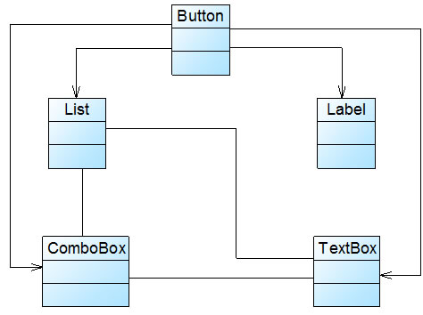
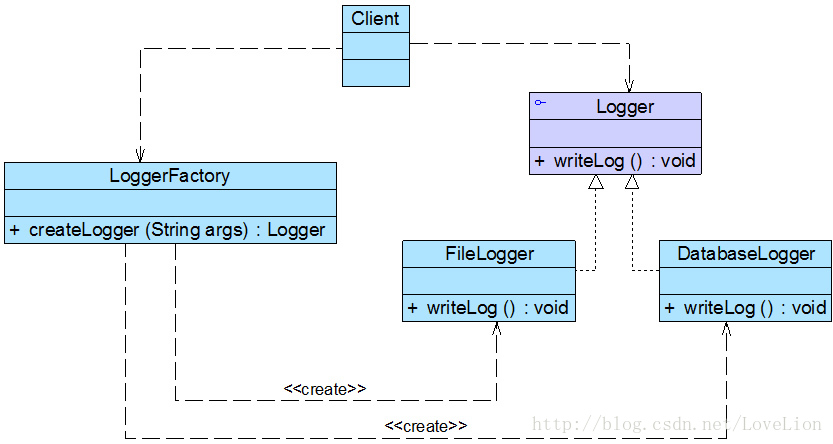
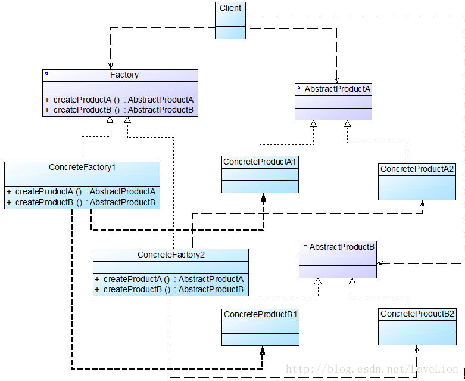
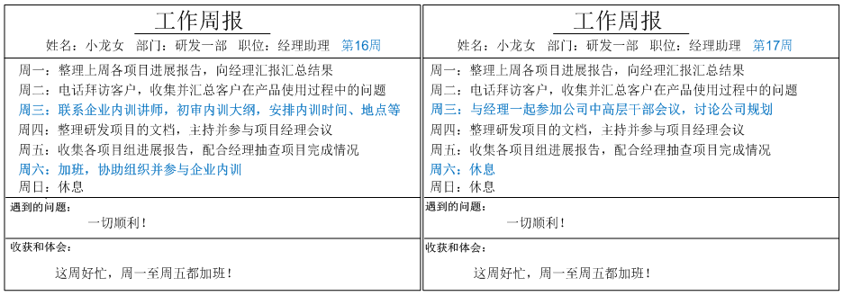

# 设计模式


[TOC]


## 概述

### 常用设计模式一览表


|             类型              |                  模式名称                  | 学习难度 | 使用频率 |
| :---------------------------: | :----------------------------------------: | :------: | :------: |
| 创建型模式 Creational Pattern |         单例模式 Singleton Pattern         |  ★☆☆☆☆   |  ★★★★☆   |
| 创建型模式 Creational Pattern |    简单工厂模式 Simple Factory Pattern     |  ★★☆☆☆   |  ★★★☆☆   |
| 创建型模式 Creational Pattern |    工厂方法模式 Factory Method Pattern     |  ★★☆☆☆   |  ★★★★★   |
| 创建型模式 Creational Pattern |   抽象工厂模式 Abstract Factory Pattern    |  ★★★★☆   |  ★★★★★   |
| 创建型模式 Creational Pattern |         原型模式 Prototype Pattern         |  ★★★☆☆   |  ★★★☆☆   |
| 创建型模式 Creational Pattern |         建造者模式 Builder Pattern         |  ★★★★☆   |  ★★☆☆☆   |
| 结构型模式 Structural Pattern |         适配器模式 Adapter Pattern         |  ★★☆☆☆   |  ★★★★☆   |
| 结构型模式 Structural Pattern |          桥接模式 Bridge Pattern           |  ★★★☆☆   |  ★★★☆☆   |
| 结构型模式 Structural Pattern |         组合模式 Composite Pattern         |  ★★★☆☆   |  ★★★★☆   |
| 结构型模式 Structural Pattern |         装饰模式 Decorator Pattern         |  ★★★☆☆   |  ★★★☆☆   |
| 结构型模式 Structural Pattern |          外观模式 Façade Pattern           |  ★☆☆☆☆   |  ★★★★★   |
| 结构型模式 Structural Pattern |         享元模式 Flyweight Pattern         |  ★★★★☆   |  ★☆☆☆☆   |
| 结构型模式 Structural Pattern |           代理模式 Proxy Pattern           |  ★★★☆☆   |  ★★★★☆   |
| 行为型模式 Behavioral Pattern | 职责链模式 Chain of Responsibility Pattern |  ★★★☆☆   |  ★★☆☆☆   |
| 行为型模式 Behavioral Pattern |          命令模式 Command Pattern          |  ★★★☆☆   |  ★★★★☆   |
| 行为型模式 Behavioral Pattern |       解释器模式 Interpreter Pattern       |  ★★★★★   |  ★☆☆☆☆   |
| 行为型模式 Behavioral Pattern |        迭代器模式 Iterator Pattern         |  ★★★☆☆   |  ★★★★★   |
| 行为型模式 Behavioral Pattern |        中介者模式 Mediator Pattern         |  ★★★☆☆   |  ★★☆☆☆   |
| 行为型模式 Behavioral Pattern |         备忘录模式 Memento Pattern         |  ★★☆☆☆   |  ★★☆☆☆   |
| 行为型模式 Behavioral Pattern |        观察者模式 Observer Pattern         |  ★★★☆☆   |  ★★★★★   |
| 行为型模式 Behavioral Pattern |           状态模式 State Pattern           |  ★★★☆☆   |  ★★★☆☆   |
| 行为型模式 Behavioral Pattern |         策略模式 Strategy Pattern          |  ★☆☆☆☆   |  ★★★★☆   |
| 行为型模式 Behavioral Pattern |    模板方法模式 Template Method Pattern    |  ★★☆☆☆   |  ★★★☆☆   |
| 行为型模式 Behavioral Pattern |         访问者模式 Visitor Pattern         |  ★★★★☆   |  ★☆☆☆☆   |

### 7种常用的面向对象设计原则

|                    设计原则名称                     |                      定 义                       | 使用频率 |
| :-------------------------------------------------: | :----------------------------------------------: | :------: |
| 单一职责原则 (Single Responsibility Principle, SRP) |       一个类只负责一个功能领域中的相应职责       |  ★★★★☆   |
|        开闭原则 (Open-Closed Principle, OCP)        |        软件实体应对扩展开放，而对修改关闭        |  ★★★★★   |
|  里氏代换原则 (Liskov Substitution Principle, LSP)  | 所有引用基类对象的地方能够透明地使用其子类的对象 |  ★★★★★   |
| 依赖倒转原则 (Dependence Inversion Principle, DIP)  |     抽象不应该依赖于细节，细节应该依赖于抽象     |  ★★★★★   |
| 接口隔离原则 (Interface Segregation Principle, ISP) |     使用多个专门的接口，而不使用单一的总接口     |  ★★☆☆☆   |
|    合成复用原则 (Composite Reuse Principle, CRP)    |   尽量使用对象组合，而不是继承来达到复用的目的   |  ★★★★☆   |
|          迪米特法则 (Law of Demeter, LoD)           | 一个软件实体应当尽可能少地与其他实体发生相互作用 |  ★★★☆☆   |

## 面向对象设计原则

### 面向对象设计原则之单一职责原则

单一职责原则是最简单的面向对象设计原则，它用于控制类的粒度大小。单一职责原则定义如下： 单一职责原则(Single Responsibility Principle, SRP)：一个类只负责一个功能领域中的相应职责，或者可以定义为：就一个类而言，应该只有一个引起它变化的原因。

单一职责原则告诉我们：一个类不能太“累”！在软件系统中，一个类（大到模块，小到方法）承担的职责越多，它被复用的可能性就越小，而且一个类承担的职责过多，就相当于将这些职责耦合在一起，当其中一个职责变化时，可能会影响其他职责的运作，因此要将这些职责进行分离，将不同的职责封装在不同的类中，即将不同的变化原因封装在不同的类中，如果多个职责总是同时发生改变则可将它们封装在同一类中。

单一职责原则是实现高内聚、低耦合的指导方针，它是最简单但又最难运用的原则，需要设计人员发现类的不同职责并将其分离，而发现类的多重职责需要设计人员具有较强的分析设计能力和相关实践经验。

下面通过一个简单实例来进一步分析单一职责原则：

Sunny软件公司开发人员针对某CRM（Customer Relationship Management，客户关系管理）系统中客户信息图形统计模块提出了如图1所示初始设计方案：


在图1中，CustomerDataChart类中的方法说明如下：getConnection()方法用于连接数据库，findCustomers()用于查询所有的客户信息，createChart()用于创建图表，displayChart()用于显示图表。

现使用单一职责原则对其进行重构。

在图1中，CustomerDataChart类承担了太多的职责，既包含与数据库相关的方法，又包含与图表生成和显示相关的方法。如果在其他类中也需要连接数据库或者使用findCustomers()方法查询客户信息，则难以实现代码的重用。无论是修改数据库连接方式还是修改图表显示方式都需要修改该类，它不止一个引起它变化的原因，违背了单一职责原则。因此需要对该类进行拆分，使其满足单一职责原则，类CustomerDataChart可拆分为如下三个类：

(1) DBUtil：负责连接数据库，包含数据库连接方法getConnection()；

(2) CustomerDAO：负责操作数据库中的Customer表，包含对Customer表的增删改查等方法，如findCustomers()；

(3) CustomerDataChart：负责图表的生成和显示，包含方法createChart()和displayChart()。

使用单一职责原则重构后的结构如图2所示：


### 面向对象设计原则之开闭原则

开闭原则是面向对象的可复用设计的第一块基石，它是最重要的面向对象设计原则。开闭原则由Bertrand Meyer于1988年提出，其定义如下：

开闭原则(Open-Closed Principle, OCP)：一个软件实体应当对扩展开放，对修改关闭。即软件实体应尽量在不修改原有代码的情况下进行扩展。

在开闭原则的定义中，软件实体可以指一个软件模块、一个由多个类组成的局部结构或一个独立的类。

任何软件都需要面临一个很重要的问题，即它们的需求会随时间的推移而发生变化。当软件系统需要面对新的需求时，我们应该尽量保证系统的设计框架是稳定的。如果一个软件设计符合开闭原则，那么可以非常方便地对系统进行扩展，而且在扩展时无须修改现有代码，使得软件系统在拥有适应性和灵活性的同时具备较好的稳定性和延续性。随着软件规模越来越大，软件寿命越来越长，软件维护成本越来越高，设计满足开闭原则的软件系统也变得越来越重要。

为了满足开闭原则，需要对系统进行抽象化设计，抽象化是开闭原则的关键。在Java、C#等编程语言中，可以为系统定义一个相对稳定的抽象层，而将不同的实现行为移至具体的实现层中完成。在很多面向对象编程语言中都提供了接口、抽象类等机制，可以通过它们定义系统的抽象层，再通过具体类来进行扩展。如果需要修改系统的行为，无须对抽象层进行任何改动，只需要增加新的具体类来实现新的业务功能即可，实现在不修改已有代码的基础上扩展系统的功能，达到开闭原则的要求。


Sunny软件公司开发的CRM系统可以显示各种类型的图表，如饼状图和柱状图等，为了支持多种图表显示方式，原始设计方案如图1所示：


图1 初始设计方案结构图

在ChartDisplay类的display()方法中存在如下代码片段：

```java
......  
if (type.equals("pie")) {
    PieChart chart = new PieChart();
    chart.display();
}  else if (type.equals("bar")) {
    BarChart chart = new BarChart();
    chart.display();  
}  
......
```

在该代码中，如果需要增加一个新的图表类，如折线图LineChart，则需要修改ChartDisplay类的display()方法的源代码，增加新的判断逻辑，违反了开闭原则。

现对该系统进行重构，使之符合开闭原则。

在本实例中，由于在ChartDisplay类的display()方法中针对每一个图表类编程，因此增加新的图表类不得不修改源代码。可以通过抽象化的方式对系统进行重构，使之增加新的图表类时无须修改源代码，满足开闭原则。

具体做法如下：

(1) 增加一个抽象图表类AbstractChart，将各种具体图表类作为其子类；

(2) ChartDisplay类针对抽象图表类进行编程，由客户端来决定使用哪种具体图表。

重构后结构如图2所示：


图2 重构后的结构图

在图2中，我们引入了抽象图表类AbstractChart，且ChartDisplay针对抽象图表类进行编程，并通过setChart()方法由客户端来设置实例化的具体图表对象，在ChartDisplay的display()方法中调用chart对象的display()方法显示图表。如果需要增加一种新的图表，如折线图LineChart，只需要将LineChart也作为AbstractChart的子类，在客户端向ChartDisplay中注入一个LineChart对象即可，无须修改现有类库的源代码。

注意：因为xml和properties等格式的配置文件是纯文本文件，可以直接通过VI编辑器或记事本进行编辑，且无须编译，因此在软件开发中，一般不把对配置文件的修改认为是对系统源代码的修改。如果一个系统在扩展时只涉及到修改配置文件，而原有的Java代码或C#代码没有做任何修改，该系统即可认为是一个符合开闭原则的系统。

### 面向对象设计原则之里氏代换原则

里氏代换原则由2008年图灵奖得主、美国第一位计算机科学女博士Barbara Liskov教授和卡内基·梅隆大学Jeannette Wing教授于1994年提出。其严格表述如下：如果对每一个类型为S的对象o1，都有类型为T的对象o2，使得以T定义的所有程序P在所有的对象o1代换o2时，程序P的行为没有变化，那么类型S是类型T的子类型。这个定义比较拗口且难以理解，因此我们一般使用它的另一个通俗版定义： 里氏代换原则(Liskov Substitution Principle, LSP)：所有引用基类（父类）的地方必须能透明地使用其子类的对象。

里氏代换原则告诉我们，在软件中将一个基类对象替换成它的子类对象，程序将不会产生任何错误和异常，反过来则不成立，如果一个软件实体使用的是一个子类对象的话，那么它不一定能够使用基类对象。例如：我喜欢动物，那我一定喜欢狗，因为狗是动物的子类；但是我喜欢狗，不能据此断定我喜欢动物，因为我并不喜欢老鼠，虽然它也是动物。

例如有两个类，一个类为BaseClass，另一个是SubClass类，并且SubClass类是BaseClass类的子类，那么一个方法如果可以接受一个BaseClass类型的基类对象base的话，如：method1(base)，那么它必然可以接受一个BaseClass类型的子类对象sub，method1(sub)能够正常运行。反过来的代换不成立，如一个方法method2接受BaseClass类型的子类对象sub为参数：method2(sub)，那么一般而言不可以有method2(base)，除非是重载方法。

里氏代换原则是实现开闭原则的重要方式之一，由于使用基类对象的地方都可以使用子类对象，因此在程序中尽量使用基类类型来对对象进行定义，而在运行时再确定其子类类型，用子类对象来替换父类对象。

在使用里氏代换原则时需要注意如下几个问题：

(1)子类的所有方法必须在父类中声明，或子类必须实现父类中声明的所有方法。根据里氏代换原则，为了保证系统的扩展性，在程序中通常使用父类来进行定义，如果一个方法只存在子类中，在父类中不提供相应的声明，则无法在以父类定义的对象中使用该方法。

(2) 我们在运用里氏代换原则时，尽量把父类设计为抽象类或者接口，让子类继承父类或实现父接口，并实现在父类中声明的方法，运行时，子类实例替换父类实例，我们可以很方便地扩展系统的功能，同时无须修改原有子类的代码，增加新的功能可以通过增加一个新的子类来实现。里氏代换原则是开闭原则的具体实现手段之一。

(3) Java语言中，在编译阶段，Java编译器会检查一个程序是否符合里氏代换原则，这是一个与实现无关的、纯语法意义上的检查，但Java编译器的检查是有局限的。

在Sunny软件公司开发的CRM系统中，客户(Customer)可以分为VIP客户(VIPCustomer)和普通客户(CommonCustomer)两类，系统需要提供一个发送Email的功能，原始设计方案如图1所示：

图1原始结构图


在对系统进行进一步分析后发现，无论是普通客户还是VIP客户，发送邮件的过程都是相同的，也就是说两个send()方法中的代码重复，而且在本系统中还将增加新类型的客户。为了让系统具有更好的扩展性，同时减少代码重复，使用里氏代换原则对其进行重构。

在本实例中，可以考虑增加一个新的抽象客户类Customer，而将CommonCustomer和VIPCustomer类作为其子类，邮件发送类EmailSender类针对抽象客户类Customer编程，根据里氏代换原则，能够接受基类对象的地方必然能够接受子类对象，因此将EmailSender中的send()方法的参数类型改为Customer，如果需要增加新类型的客户，只需将其作为Customer类的子类即可。重构后的结构如图2所示：


图2 重构后的结构图

里氏代换原则是实现开闭原则的重要方式之一。在本实例中，在传递参数时使用基类对象，除此以外，在定义成员变量、定义局部变量、确定方法返回类型时都可使用里氏代换原则。针对基类编程，在程序运行时再确定具体子类。

扩展

里氏代换原则以Barbara Liskov（芭芭拉·利斯科夫）教授的姓氏命名。芭芭拉·利斯科夫：美国计算机科学家，2008年图灵奖得主，2004年约翰·冯诺依曼奖得主，美国工程院院士，美国艺术与科学院院士，美国计算机协会会士，麻省理工学院电子电气与计算机科学系教授，美国第一位计算机科学女博士。

### 面向对象设计原则之依赖倒转原则

如果说开闭原则是面向对象设计的目标的话，那么依赖倒转原则就是面向对象设计的主要实现机制之一，它是系统抽象化的具体实现。依赖倒转原则是Robert C. Martin在1996年为“C++Reporter”所写的专栏Engineering Notebook的第三篇，后来加入到他在2002年出版的经典著作“Agile Software Development, Principles, Patterns, and Practices”一书中。依赖倒转原则定义如下： 依赖倒转原则(Dependency Inversion Principle, DIP)：抽象不应该依赖于细节，细节应当依赖于抽象。换言之，要针对接口编程，而不是针对实现编程。

依赖倒转原则要求我们**在程序代码中传递参数时或在关联关系中，尽量引用层次高的抽象层类，即使用接口和抽象类进行变量类型声明、参数类型声明、方法返回类型声明，以及数据类型的转换等，而不要用具体类来做这些事情**。为了确保该原则的应用，**一个具体类应当只实现接口或抽象类中声明过的方法，而不要给出多余的方法**，否则将无法调用到在子类中增加的新方法。

在引入抽象层后，系统将具有很好的灵活性，在程序中尽量使用抽象层进行编程，而将具体类写在配置文件中，这样一来，如果系统行为发生变化，只需要对抽象层进行扩展，并修改配置文件，而无须修改原有系统的源代码，在不修改的情况下来扩展系统的功能，满足开闭原则的要求。

在实现依赖倒转原则时，我们需要针对抽象层编程，而将具体类的对象通过依赖注入(DependencyInjection, DI)的方式注入到其他对象中，依赖注入是指当一个对象要与其他对象发生依赖关系时，通过抽象来注入所依赖的对象。常用的注入方式有三种，分别是：构造注入，设值注入（Setter注入）和接口注入。构造注入是指通过构造函数来传入具体类的对象，设值注入是指通过Setter方法来传入具体类的对象，而接口注入是指通过在接口中声明的业务方法来传入具体类的对象。这些方法在定义时使用的是抽象类型，在运行时再传入具体类型的对象，由子类对象来覆盖父类对象。

下面通过一个简单实例来加深对依赖倒转原则的理解：

Sunny软件公司开发人员在开发某CRM系统时发现：该系统经常需要将存储在TXT或Excel文件中的客户信息转存到数据库中，因此需要进行数据格式转换。在客户数据操作类中将调用数据格式转换类的方法实现格式转换和数据库插入操作，初始设计方案结构如图1所示：


图1 初始设计方案结构图

在编码实现图1所示结构时，Sunny软件公司开发人员发现该设计方案存在一个非常严重的问题，由于每次转换数据时数据来源不一定相同，因此需要更换数据转换类，如有时候需要将TXTDataConvertor改为ExcelDataConvertor，此时，需要修改CustomerDAO的源代码，而且在引入并使用新的数据转换类时也不得不修改CustomerDAO的源代码，系统扩展性较差，违反了开闭原则，现需要对该方案进行重构。

在本实例中，由于CustomerDAO针对具体数据转换类编程，因此在增加新的数据转换类或者更换数据转换类时都不得不修改CustomerDAO的源代码。我们可以通过引入抽象数据转换类解决该问题，在引入抽象数据转换类DataConvertor之后，CustomerDAO针对抽象类DataConvertor编程，而将具体数据转换类名存储在配置文件中，符合依赖倒转原则。根据里氏代换原则，程序运行时，具体数据转换类对象将替换DataConvertor类型的对象，程序不会出现任何问题。更换具体数据转换类时无须修改源代码，只需要修改配置文件；如果需要增加新的具体数据转换类，只要将新增数据转换类作为DataConvertor的子类并修改配置文件即可，原有代码无须做任何修改，满足开闭原则。重构后的结构如图2所示：


图2重构后的结构图

在上述重构过程中，我们使用了开闭原则、里氏代换原则和依赖倒转原则，在**大多数情况下，这三个设计原则会同时出现，开闭原则是目标，里氏代换原则是基础，依赖倒转原则是手段，它们相辅相成，相互补充，目标一致，只是分析问题时所站角度不同而已。**

### 面向对象设计原则之接口隔离原则

接口隔离原则定义如下：

> 接口隔离原则(Interface Segregation Principle, ISP)：使用多个专门的接口，而不使用单一的总接口，即客户端不应该依赖那些它不需要的接口。

根据接口隔离原则，当一个接口太大时，我们需要将它分割成一些更细小的接口，使用该接口的客户端仅需知道与之相关的方法即可。每一个接口应该承担一种相对独立的角色，不干不该干的事，该干的事都要干。这里的“接口”往往有两种不同的含义：一种是指一个类型所具有的方法特征的集合，仅仅是一种逻辑上的抽象；另外一种是指某种语言具体的“接口”定义，有严格的定义和结构，比如Java语言中的interface。对于这两种不同的含义，ISP的表达方式以及含义都有所不同：

(1) 当把“接口”理解成一个类型所提供的所有方法特征的集合的时候，这就是一种逻辑上的概念，接口的划分将直接带来类型的划分。可以把接口理解成角色，一个接口只能代表一个角色，每个角色都有它特定的一个接口，此时，这个原则可以叫做“角色隔离原则”。

(2) 如果把“接口”理解成狭义的特定语言的接口，那么ISP表达的意思是指接口仅仅提供客户端需要的行为，客户端不需要的行为则隐藏起来，应当为客户端提供尽可能小的单独的接口，而不要提供大的总接口。在面向对象编程语言中，实现一个接口就需要实现该接口中定义的所有方法，因此大的总接口使用起来不一定很方便，为了使接口的职责单一，需要将大接口中的方法根据其职责不同分别放在不同的小接口中，以确保每个接口使用起来都较为方便，并都承担某一单一角色。接口应该尽量细化，同时接口中的方法应该尽量少，每个接口中只包含一个客户端（如子模块或业务逻辑类）所需的方法即可，这种机制也称为“定制服务”，即为不同的客户端提供宽窄不同的接口。

下面通过一个简单实例来加深对接口隔离原则的理解：

Sunny软件公司开发人员针对某CRM系统的客户数据显示模块设计了如图1所示接口，其中方法dataRead()用于从文件中读取数据，方法transformToXML()用于将数据转换成XML格式，方法createChart()用于创建图表，方法displayChart()用于显示图表，方法createReport()用于创建文字报表，方法displayReport()用于显示文字报表。


图1 初始设计方案结构图

在实际使用过程中发现该接口很不灵活，例如如果一个具体的数据显示类无须进行数据转换（源文件本身就是XML格式），但由于实现了该接口，将不得不实现其中声明的transformToXML()方法（至少需要提供一个空实现）；如果需要创建和显示图表，除了需实现与图表相关的方法外，还需要实现创建和显示文字报表的方法，否则程序编译时将报错。

现使用接口隔离原则对其进行重构。

在图1中，由于在接口CustomerDataDisplay中定义了太多方法，即该接口承担了太多职责，一方面导致该接口的实现类很庞大，在不同的实现类中都不得不实现接口中定义的所有方法，灵活性较差，如果出现大量的空方法，将导致系统中产生大量的无用代码，影响代码质量；另一方面由于客户端针对大接口编程，将在一定程序上破坏程序的封装性，客户端看到了不应该看到的方法，没有为客户端定制接口。因此需要将该接口按照接口隔离原则和单一职责原则进行重构，将其中的一些方法封装在不同的小接口中，确保每一个接口使用起来都较为方便，并都承担某一单一角色，每个接口中只包含一个客户端（如模块或类）所需的方法即可。

通过使用接口隔离原则，本实例重构后的结构如图2所示：


图2 重构后的结构图

在使用接口隔离原则时，我们需要注意控制接口的粒度，接口不能太小，如果太小会导致系统中接口泛滥，不利于维护；接口也不能太大，太大的接口将违背接口隔离原则，灵活性较差，使用起来很不方便。一般而言，接口中仅包含为某一类用户定制的方法即可，不应该强迫客户依赖于那些它们不用的方法。

### 面向对象设计原则之合成复用原则

合成复用原则又称为组合/聚合复用原则(Composition/Aggregate Reuse Principle, CARP)，其定义如下：

> 合成复用原则(Composite Reuse Principle, CRP)：尽量使用对象组合，而不是继承来达到复用的目的。

合成复用原则就是在一个新的对象里通过关联关系（包括组合关系和聚合关系）来使用一些已有的对象，使之成为新对象的一部分；新对象通过委派调用已有对象的方法达到复用功能的目的。简言之：复用时要尽量使用组合/聚合关系（关联关系），少用继承。

在面向对象设计中，可以通过两种方法在不同的环境中复用已有的设计和实现，即通过组合/聚合关系或通过继承，但首先应该考虑使用组合/聚合，组合/聚合可以使系统更加灵活，降低类与类之间的耦合度，一个类的变化对其他类造成的影响相对较少；其次才考虑继承，在使用继承时，需要严格遵循里氏代换原则，有效使用继承会有助于对问题的理解，降低复杂度，而滥用继承反而会增加系统构建和维护的难度以及系统的复杂度，因此需要慎重使用继承复用。

通过继承来进行复用的主要问题在于继承复用会破坏系统的封装性，因为继承会将基类的实现细节暴露给子类，由于基类的内部细节通常对子类来说是可见的，所以这种复用又称“白箱”复用，如果基类发生改变，那么子类的实现也不得不发生改变；从基类继承而来的实现是静态的，不可能在运行时发生改变，没有足够的灵活性；而且继承只能在有限的环境中使用（如类没有声明为不能被继承）。

扩展

对于继承的深入理解，大家可以参考《软件架构设计》一书作者温昱先生的文章——《见山只是山见水只是水——提升对继承的认识》。

由于组合或聚合关系可以将已有的对象（也可称为成员对象）纳入到新对象中，使之成为新对象的一部分，因此新对象可以调用已有对象的功能，这样做可以使得成员对象的内部实现细节对于新对象不可见，所以这种复用又称为“黑箱”复用，相对继承关系而言，其耦合度相对较低，成员对象的变化对新对象的影响不大，可以在新对象中根据实际需要有选择性地调用成员对象的操作；合成复用可以在运行时动态进行，新对象可以动态地引用与成员对象类型相同的其他对象。

一般而言，如果两个类之间是“Has-A”的关系应使用组合或聚合，如果是“Is-A”关系可使用继承。”Is-A”是严格的分类学意义上的定义，意思是一个类是另一个类的”一种”；而”Has-A”则不同，它表示某一个角色具有某一项责任。

下面通过一个简单实例来加深对合成复用原则的理解：

Sunny软件公司开发人员在初期的CRM系统设计中，考虑到客户数量不多，系统采用MySQL作为数据库，与数据库操作有关的类如CustomerDAO类等都需要连接数据库，连接数据库的方法getConnection()封装在DBUtil类中，由于需要重用DBUtil类的getConnection()方法，设计人员将CustomerDAO作为DBUtil类的子类，初始设计方案结构如图1所示：


图1 初始设计方案结构图

随着客户数量的增加，系统决定升级为Oracle数据库，因此需要增加一个新的OracleDBUtil类来连接Oracle数据库，由于在初始设计方案中CustomerDAO和DBUtil之间是继承关系，因此在更换数据库连接方式时需要修改CustomerDAO类的源代码，将CustomerDAO作为OracleDBUtil的子类，这将违反开闭原则。【当然也可以修改DBUtil类的源代码，同样会违反开闭原则。】

现使用合成复用原则对其进行重构。

根据合成复用原则，我们在实现复用时应该多用关联，少用继承。因此在本实例中我们可以使用关联复用来取代继承复用，重构后的结构如图2所示：


图2 重构后的结构图

在图2中，CustomerDAO和DBUtil之间的关系由继承关系变为关联关系，采用依赖注入的方式将DBUtil对象注入到CustomerDAO中，可以使用构造注入，也可以使用Setter注入。如果需要对DBUtil的功能进行扩展，可以通过其子类来实现，如通过子类OracleDBUtil来连接Oracle数据库。由于CustomerDAO针对DBUtil编程，根据里氏代换原则，DBUtil子类的对象可以覆盖DBUtil对象，只需在CustomerDAO中注入子类对象即可使用子类所扩展的方法。例如在CustomerDAO中注入OracleDBUtil对象，即可实现Oracle数据库连接，原有代码无须进行修改，而且还可以很灵活地增加新的数据库连接方式。

### 面向对象设计原则之迪米特法则

迪米特法则来自于1987年美国东北大学(Northeastern University)一个名为“Demeter”的研究项目。迪米特法则又称为最少知识原则(LeastKnowledge Principle, LKP)，其定义如下：

> 迪米特法则(Law of Demeter, LoD)：一个软件实体应当尽可能少地与其他实体发生相互作用。

如果一个系统符合迪米特法则，那么当其中某一个模块发生修改时，就会尽量少地影响其他模块，扩展会相对容易，这是对软件实体之间通信的限制，迪米特法则要求限制软件实体之间通信的宽度和深度。迪米特法则可降低系统的耦合度，使类与类之间保持松散的耦合关系。

迪米特法则还有几种定义形式，包括：不要和“陌生人”说话、只与你的直接朋友通信等，在迪米特法则中，对于一个对象，其朋友包括以下几类：

(1) 当前对象本身(this)；

(2) 以参数形式传入到当前对象方法中的对象；

(3) 当前对象的成员对象；

(4) 如果当前对象的成员对象是一个集合，那么集合中的元素也都是朋友；

(5) 当前对象所创建的对象。

任何一个对象，如果满足上面的条件之一，就是当前对象的“朋友”，否则就是“陌生人”。在应用迪米特法则时，一个对象只能与直接朋友发生交互，不要与“陌生人”发生直接交互，这样做可以降低系统的耦合度，一个对象的改变不会给太多其他对象带来影响。

迪米特法则要求我们在设计系统时，应该尽量减少对象之间的交互，如果两个对象之间不必彼此直接通信，那么这两个对象就不应当发生任何直接的相互作用，如果其中的一个对象需要调用另一个对象的某一个方法的话，可以通过第三者转发这个调用。简言之，就是通过引入一个合理的第三者来降低现有对象之间的耦合度。

在将迪米特法则运用到系统设计中时，要注意下面的几点：在类的划分上，应当尽量创建松耦合的类，类之间的耦合度越低，就越有利于复用，一个处在松耦合中的类一旦被修改，不会对关联的类造成太大波及；在类的结构设计上，每一个类都应当尽量降低其成员变量和成员函数的访问权限；在类的设计上，只要有可能，一个类型应当设计成不变类；在对其他类的引用上，一个对象对其他对象的引用应当降到最低。

下面通过一个简单实例来加深对迪米特法则的理解：

Sunny软件公司所开发CRM系统包含很多业务操作窗口，在这些窗口中，某些界面控件之间存在复杂的交互关系，一个控件事件的触发将导致多个其他界面控件产生响应，例如，当一个按钮(Button)被单击时，对应的列表框(List)、组合框(ComboBox)、文本框(TextBox)、文本标签(Label)等都将发生改变，在初始设计方案中，界面控件之间的交互关系可简化为如图1所示结构：



图1 初始设计方案结构图

在图1中，由于界面控件之间的交互关系复杂，导致在该窗口中增加新的界面控件时需要修改与之交互的其他控件的源代码，系统扩展性较差，也不便于增加和删除新控件。

现使用迪米特对其进行重构。

在本实例中，可以通过引入一个专门用于控制界面控件交互的中间类(Mediator)来降低界面控件之间的耦合度。引入中间类之后，界面控件之间不再发生直接引用，而是将请求先转发给中间类，再由中间类来完成对其他控件的调用。当需要增加或删除新的控件时，只需修改中间类即可，无须修改新增控件或已有控件的源代码，重构后结构如图2所示：


## 六个创建型模式

### 简单工厂模式-Simple Factory Pattern

#### 工厂三兄弟之简单工厂模式（一）

工厂模式是最常用的一类创建型设计模式，通常我们所说的工厂模式是指工厂方法模式，它也是使用频率最高的工厂模式。本章将要学习的简单工厂模式是工厂方法模式的“小弟”，它不属于GoF 23种设计模式，但在软件开发中应用也较为频繁，通常将它作为学习其他工厂模式的入门。此外，工厂方法模式还有一位“大哥”——抽象工厂模式。这三种工厂模式各具特色，难度也逐个加大，在软件开发中它们都得到了广泛的应用，成为面向对象软件中常用的创建对象的工具。

1 图表库的设计

Sunny软件公司欲基于Java语言开发一套图表库，该图表库可以为应用系统提供各种不同外观的图表，例如柱状图、饼状图、折线图等。Sunny软件公司图表库设计人员希望为应用系统开发人员提供一套灵活易用的图表库，而且可以较为方便地对图表库进行扩展，以便能够在将来增加一些新类型的图表。

Sunny软件公司图表库设计人员提出了一个初始设计方案，将所有图表的实现代码封装在一个Chart类中，其框架代码如下所示：

```java
class Chart {  
    private String type; //图表类型  
    public Chart(Object[][] data, String type) {  
        this.type = type;  
        if (type.equalsIgnoreCase("histogram")) {  
            //初始化柱状图  
        }  
        else if (type.equalsIgnoreCase("pie")) {  
            //初始化饼状图  
        }  
        else if (type.equalsIgnoreCase("line")) {  
            //初始化折线图  
        }  
    }  
    public void display() {  
        if (this.type.equalsIgnoreCase("histogram")) {  
            //显示柱状图  
        }  
        else if (this.type.equalsIgnoreCase("pie")) {  
            //显示饼状图  
        }  
        else if (this.type.equalsIgnoreCase("line")) {  
            //显示折线图  
        }     
    }  
}
```

客户端代码通过调用Chart类的构造函数来创建图表对象，根据参数type的不同可以得到不同类型的图表，然后再调用display()方法来显示相应的图表。

不难看出，Chart类是一个“巨大的”类，在该类的设计中存在如下几个问题：

(1) 在Chart类中包含很多“if…else…”代码块，整个类的代码相当冗长，代码越长，阅读难度、维护难度和测试难度也越大；而且大量条件语句的存在还将影响系统的性能，程序在执行过程中需要做大量的条件判断。

(2) Chart类的职责过重，它负责初始化和显示所有的图表对象，将各种图表对象的初始化代码和显示代码集中在一个类中实现，违反了“单一职责原则”，不利于类的重用和维护；而且将大量的对象初始化代码都写在构造函数中将导致构造函数非常庞大，对象在创建时需要进行条件判断，降低了对象创建的效率。

(3) 当需要增加新类型的图表时，必须修改Chart类的源代码，违反了“开闭原则”。

(4) 客户端只能通过new关键字来直接创建Chart对象，Chart类与客户端类耦合度较高，对象的创建和使用无法分离。

(5) 客户端在创建Chart对象之前可能还需要进行大量初始化设置，例如设置柱状图的颜色、高度等，如果在Chart类的构造函数中没有提供一个默认设置，那就只能由客户端来完成初始设置，这些代码在每次创建Chart对象时都会出现，导致代码的重复。

面对一个如此巨大、职责如此重，且与客户端代码耦合度非常高的类，我们应该怎么办？本章将要介绍的简单工厂模式将在一定程度上解决上述问题。

为什么要引入工厂类，大家可参见：[创建对象与使用对象——谈谈工厂的作用](http://blog.csdn.net/lovelion/article/details/7523392)。

#### 工厂三兄弟之简单工厂模式（二）

2 简单工厂模式概述

简单工厂模式并不属于GoF 23个经典设计模式，但通常将它作为学习其他工厂模式的基础，它的设计思想很简单，其基本流程如下：

首先将需要创建的各种不同对象（例如各种不同的Chart对象）的相关代码封装到不同的类中，这些类称为具体产品类，而将它们公共的代码进行抽象和提取后封装在一个抽象产品类中，每一个具体产品类都是抽象产品类的子类；然后提供一个工厂类用于创建各种产品，在工厂类中提供一个创建产品的工厂方法，该方法可以根据所传入的参数不同创建不同的具体产品对象；客户端只需调用工厂类的工厂方法并传入相应的参数即可得到一个产品对象。

简单工厂模式定义如下：

**简单工厂模式(Simple Factory Pattern)：定义一个工厂类，它可以根据参数的不同返回不同类的实例，被创建的实例通常都具有共同的父类。因为在简单工厂模式中用于创建实例的方法是静态(static)方法，因此简单工厂模式又被称为静态工厂方法(Static Factory Method)模式，它属于类创建型模式。**

简单工厂模式的要点在于：当你需要什么，只需要传入一个正确的参数，就可以获取你所需要的对象，而无须知道其创建细节。简单工厂模式结构比较简单，其核心是工厂类的设计，其结构如图1所示：


图1 简单工厂模式结构图

在简单工厂模式结构图中包含如下几个角色：

● Factory（工厂角色）：工厂角色即工厂类，它是简单工厂模式的核心，负责实现创建所有产品实例的内部逻辑；工厂类可以被外界直接调用，创建所需的产品对象；在工厂类中提供了静态的工厂方法factoryMethod()，它的返回类型为抽象产品类型Product。

● Product（抽象产品角色）：它是工厂类所创建的所有对象的父类，封装了各种产品对象的公有方法，它的引入将提高系统的灵活性，使得在工厂类中只需定义一个通用的工厂方法，因为所有创建的具体产品对象都是其子类对象。

● ConcreteProduct（具体产品角色）：它是简单工厂模式的创建目标，所有被创建的对象都充当这个角色的某个具体类的实例。每一个具体产品角色都继承了抽象产品角色，需要实现在抽象产品中声明的抽象方法。

在简单工厂模式中，**客户端通过工厂类来创建一个产品类的实例，而无须直接使用new关键字来创建对象，它是工厂模式家族中最简单的一员**。

在使用简单工厂模式时，首先需要对产品类进行重构，不能设计一个包罗万象的产品类，而需根据实际情况设计一个产品层次结构，将所有产品类公共的代码移至抽象产品类，并在抽象产品类中声明一些抽象方法，以供不同的具体产品类来实现，典型的抽象产品类代码如下所示：

```java
abstract class Product {  
    //所有产品类的公共业务方法  
    public void methodSame() {  
        //公共方法的实现  
    }  
    //声明抽象业务方法  
    public abstract void methodDiff();  
}

class ConcreteProduct extends Product {  
    //实现业务方法  
    public void methodDiff() {  
        //业务方法的实现  
    }  
}
class Factory {  
    //静态工厂方法  
    public static Product getProduct(String arg) {  
        Product product = null;  
        if (arg.equalsIgnoreCase("A")) {  
            product = new ConcreteProductA();  
            //初始化设置product  
        }  
        else if (arg.equalsIgnoreCase("B")) {  
            product = new ConcreteProductB();  
            //初始化设置product  
        }  
        return product;  
    }  
}
class Client {  
    public static void main(String args[]) {  
        Product product;   
        product = Factory.getProduct("A"); //通过工厂类创建产品对象  
        product.methodSame();  
        product.methodDiff();  
    }  
}
```


#### 工厂三兄弟之简单工厂模式（三）

3 完整解决方案

为了将Chart类的职责分离，同时将Chart对象的创建和使用分离，Sunny软件公司开发人员决定使用简单工厂模式对图表库进行重构，重构后的结构如图2所示：


图2 图表库结构图

在图2中，Chart接口充当抽象产品类，其子类HistogramChart、PieChart和LineChart充当具体产品类，ChartFactory充当工厂类。完整代码如下所示：

```java
//抽象图表接口：抽象产品类  
interface Chart {  
    public void display();  
}  
//柱状图类：具体产品类  
class HistogramChart implements Chart {  
    public HistogramChart() {  
        System.out.println("创建柱状图！");  
    }  
    public void display() {  
        System.out.println("显示柱状图！");  
    }  
}  
//饼状图类：具体产品类  
class PieChart implements Chart {  
    public PieChart() {  
        System.out.println("创建饼状图！");  
    }  
    public void display() {  
        System.out.println("显示饼状图！");  
    }  
}  
//折线图类：具体产品类  
class LineChart implements Chart {  
    public LineChart() {  
        System.out.println("创建折线图！");  
    }  
    public void display() {  
        System.out.println("显示折线图！");  
    }  
}  
//图表工厂类：工厂类  
class ChartFactory {  
    //静态工厂方法  
    public static Chart getChart(String type) {  
        Chart chart = null;  
        if (type.equalsIgnoreCase("histogram")) {  
            chart = new HistogramChart();  
            System.out.println("初始化设置柱状图！");  
        }  
        else if (type.equalsIgnoreCase("pie")) {  
            chart = new PieChart();  
            System.out.println("初始化设置饼状图！");  
        }  
        else if (type.equalsIgnoreCase("line")) {  
            chart = new LineChart();  
            System.out.println("初始化设置折线图！");              
        }  
        return chart;  
    }  
}
```

编写如下客户端测试代码：

```java
class Client {  
    public static void main(String args[]) {  
        Chart chart;  
        chart = ChartFactory.getChart("histogram"); //通过静态工厂方法创建产品  
        chart.display();  
    }  
}
```

编译并运行程序，输出结果如下：

```
创建柱状图！初始化设置柱状图！显示柱状图！
```

在客户端测试类中，我们使用工厂类的静态工厂方法创建产品对象，如果需要更换产品，只需修改静态工厂方法中的参数即可，例如将柱状图改为饼状图，只需将代码：

```
chart = ChartFactory.getChart("histogram");
```

改为：

```
chart = ChartFactory.getChart("pie");
```

编译并运行程序，输出结果如下：

```
创建饼状图！
初始化设置饼状图！
显示饼状图！
```

#### 工厂三兄弟之简单工厂模式（四）

4 方案的改进

Sunny软件公司开发人员发现在创建具体Chart对象时，每更换一个Chart对象都需要修改客户端代码中静态工厂方法的参数，客户端代码将要重新编译，这对于客户端而言，违反了“开闭原则”，有没有一种方法能够在不修改客户端代码的前提下更换具体产品对象呢？答案是肯定的，下面将介绍一种常用的实现方式。

我们可以将静态工厂方法的参数存储在XML或properties格式的配置文件中，如下*config.xml*所示：

```xml
<?xml version="1.0"?>  
<config>  
    <chartType>histogram</chartType>  
</config>
```

再通过一个工具类XMLUtil来读取配置文件中的字符串参数，XMLUtil类的代码如下所示：

```java
import javax.xml.parsers.*;

import org.w3c.dom.*;

import java.io.*;

public class XMLUtil {
    //该方法用于从XML配置文件中提取图表类型，并返回类型名  
    public static String getChartType() {
        try {
            //创建文档对象  
            DocumentBuilderFactory dFactory = DocumentBuilderFactory.newInstance();
            DocumentBuilder builder = dFactory.newDocumentBuilder();
            Document doc;
            doc = builder.parse(new File("pattern/created/FactoryMethodPattern/v1/config.xml"));
            //获取包含图表类型的文本节点  
            NodeList nl = doc.getElementsByTagName("chartType");
            Node classNode = nl.item(0).getFirstChild();
            String chartType = classNode.getNodeValue().trim();
            return chartType;
        } catch (Exception e) {
            e.printStackTrace();
            return null;
        }
    }
}
```

在引入了配置文件和工具类XMLUtil之后，客户端代码修改如下：

```java
class Client {  
    public static void main(String args[]) {  
        Chart chart;  
        String type = XMLUtil.getChartType(); //读取配置文件中的参数  
        chart = ChartFactory.getChart(type); //创建产品对象  
        chart.display();  
    }  
}
```

不难发现，在上述客户端代码中不包含任何与具体图表对象相关的信息，如果需要更换具体图表对象，只需修改配置文件config.xml，无须修改任何源代码，符合“开闭原则”。

思考

> 在简单工厂模式中增加新的具体产品时是否符合“开闭原则”？如果不符合，原有系统需作出哪些修改？

5 简单工厂模式的简化

有时候，为了简化简单工厂模式，我们可以将抽象产品类和工厂类合并，将静态工厂方法移至抽象产品类中，如图3所示：


图3 简化的简单工厂模式

在图3中，客户端可以通过产品父类的静态工厂方法，根据参数的不同创建不同类型的产品子类对象，这种做法在JDK等类库和框架中也广泛存在。

6 简单工厂模式总结

简单工厂模式提供了专门的工厂类用于创建对象，将对象的创建和对象的使用分离开，它作为一种最简单的工厂模式在软件开发中得到了较为广泛的应用。

1. 主要优点

简单工厂模式的主要优点如下：

(1) 工厂类包含必要的判断逻辑，可以决定在什么时候创建哪一个产品类的实例，客户端可以免除直接创建产品对象的职责，而仅仅“消费”产品，简单工厂模式实现了对象创建和使用的分离。

(2) 客户端无须知道所创建的具体产品类的类名，只需要知道具体产品类所对应的参数即可，对于一些复杂的类名，通过简单工厂模式可以在一定程度减少使用者的记忆量。

(3) 通过引入配置文件，可以在不修改任何客户端代码的情况下更换和增加新的具体产品类，在一定程度上提高了系统的灵活性。

1. 主要缺点

简单工厂模式的主要缺点如下：

(1) 由于工厂类集中了所有产品的创建逻辑，职责过重，一旦不能正常工作，整个系统都要受到影响。

(2) 使用简单工厂模式势必会增加系统中类的个数（引入了新的工厂类），增加了系统的复杂度和理解难度。

(3) 系统扩展困难，一旦添加新产品就不得不修改工厂逻辑，在产品类型较多时，有可能造成工厂逻辑过于复杂，不利于系统的扩展和维护。

(4) 简单工厂模式由于使用了静态工厂方法，造成工厂角色无法形成基于继承的等级结构。

1. 适用场景

在以下情况下可以考虑使用简单工厂模式：

(1) 工厂类负责创建的对象比较少，由于创建的对象较少，不会造成工厂方法中的业务逻辑太过复杂。

(2) 客户端只知道传入工厂类的参数，对于如何创建对象并不关心。

### 工厂方法模式-Factory Method Pattern

#### 工厂三兄弟之工厂方法模式（一）

简单工厂模式虽然简单，但存在一个很严重的问题。当系统中需要引入新产品时，由于静态工厂方法通过所传入参数的不同来创建不同的产品，这必定要修改工厂类的源代码，将违背“开闭原则”，如何实现增加新产品而不影响已有代码？工厂方法模式应运而生，本文将介绍第二种工厂模式——工厂方法模式。

1 日志记录器的设计

Sunny软件公司欲开发一个系统运行日志记录器(Logger)，该记录器可以通过多种途径保存系统的运行日志，如通过文件记录或数据库记录，用户可以通过修改配置文件灵活地更换日志记录方式。在设计各类日志记录器时，Sunny公司的开发人员发现需要对日志记录器进行一些初始化工作，初始化参数的设置过程较为复杂，而且某些参数的设置有严格的先后次序，否则可能会发生记录失败。如何封装记录器的初始化过程并保证多种记录器切换的灵活性是Sunny公司开发人员面临的一个难题。

Sunny公司的开发人员通过对该需求进行分析，发现该日志记录器有两个设计要点：

(1) 需要封装日志记录器的初始化过程，这些初始化工作较为复杂，例如需要初始化其他相关的类，还有可能需要读取配置文件（例如连接数据库或创建文件），导致代码较长，如果将它们都写在构造函数中，会导致构造函数庞大，不利于代码的修改和维护；

(2) 用户可能需要更换日志记录方式，在客户端代码中需要提供一种灵活的方式来选择日志记录器，尽量在不修改源代码的基础上更换或者增加日志记录方式。

Sunny公司开发人员最初使用简单工厂模式对日志记录器进行了设计，初始结构如图1所示：



图1 基于简单工厂模式设计的日志记录器结构图

在图1中，LoggerFactory充当创建日志记录器的工厂，提供了工厂方法createLogger()用于创建日志记录器，Logger是抽象日志记录器接口，其子类为具体日志记录器。其中，工厂类LoggerFactory代码片段如下所示：

```java
//日志记录器工厂  
class LoggerFactory {  
    //静态工厂方法  
    public static Logger createLogger(String args) {
        if(args.equalsIgnoreCase("db")) {  
            //连接数据库，代码省略  
            //创建数据库日志记录器对象  
            Logger logger = new DatabaseLogger();   
            //初始化数据库日志记录器，代码省略  
            return logger;  
        }  
        else if(args.equalsIgnoreCase("file")) {
            //创建日志文件  
            //创建文件日志记录器对象  
            Logger logger = new FileLogger();   
            //初始化文件日志记录器，代码省略  
            return logger;            
        }  
        else {  
            return null;  
        }  
    }  
}
```

为了突出设计重点，我们对上述代码进行了简化，省略了具体日志记录器类的初始化代码。在LoggerFactory类中提供了静态工厂方法createLogger()，用于根据所传入的参数创建各种不同类型的日志记录器。通过使用简单工厂模式，我们将日志记录器对象的创建和使用分离，客户端只需使用由工厂类创建的日志记录器对象即可，无须关心对象的创建过程，但是我们发现，虽然简单工厂模式实现了对象的创建和使用分离，但是仍然存在如下两个问题：

(1) 工厂类过于庞大，包含了大量的if…else…代码，导致维护和测试难度增大；

(2) 系统扩展不灵活，如果增加新类型的日志记录器，必须修改静态工厂方法的业务逻辑，违反了“开闭原则”。

如何解决这两个问题，提供一种简单工厂模式的改进方案？这就是本文所介绍的工厂方法模式的动机之一。

#### 工厂三兄弟之工厂方法模式（二）

2 工厂方法模式概述

在简单工厂模式中只提供一个工厂类，该工厂类处于对产品类进行实例化的中心位置，它需要知道每一个产品对象的创建细节，并决定何时实例化哪一个产品类。简单工厂模式最大的缺点是当有新产品要加入到系统中时，必须修改工厂类，需要在其中加入必要的业务逻辑，这违背了“开闭原则”。此外，在简单工厂模式中，所有的产品都由同一个工厂创建，工厂类职责较重，业务逻辑较为复杂，具体产品与工厂类之间的耦合度高，严重影响了系统的灵活性和扩展性，而工厂方法模式则可以很好地解决这一问题。

在工厂方法模式中，我们不再提供一个统一的工厂类来创建所有的产品对象，而是针对不同的产品提供不同的工厂，系统提供一个与产品等级结构对应的工厂等级结构。工厂方法模式定义如下：

工厂方法模式(Factory Method Pattern)：定义一个用于创建对象的接口，让子类决定将哪一个类实例化。工厂方法模式让一个类的实例化延迟到其子类。工厂方法模式又简称为工厂模式(Factory Pattern)，又可称作虚拟构造器模式(Virtual Constructor Pattern)或多态工厂模式(Polymorphic Factory Pattern)。工厂方法模式是一种类创建型模式。

工厂方法模式提供一个抽象工厂接口来声明抽象工厂方法，而由其子类来具体实现工厂方法，创建具体的产品对象。工厂方法模式结构如图2所示：


图2 工厂方法模式结构图

在工厂方法模式结构图中包含如下几个角色：

● Product（抽象产品）：它是定义产品的接口，是工厂方法模式所创建对象的超类型，也就是产品对象的公共父类。

● ConcreteProduct（具体产品）：它实现了抽象产品接口，某种类型的具体产品由专门的具体工厂创建，具体工厂和具体产品之间一一对应。

● Factory（抽象工厂）：在抽象工厂类中，声明了工厂方法(Factory Method)，用于返回一个产品。抽象工厂是工厂方法模式的核心，所有创建对象的工厂类都必须实现该接口。

● ConcreteFactory（具体工厂）：它是抽象工厂类的子类，实现了抽象工厂中定义的工厂方法，并可由客户端调用，返回一个具体产品类的实例。

与简单工厂模式相比，工厂方法模式最重要的区别是引入了抽象工厂角色，抽象工厂可以是接口，也可以是抽象类或者具体类，其典型代码如下所示：

```java
interface Factory {  
    public Product factoryMethod();  
}
```

在抽象工厂中声明了工厂方法但并未实现工厂方法，具体产品对象的创建由其子类负责，客户端针对抽象工厂编程，可在运行时再指定具体工厂类，具体工厂类实现了工厂方法，不同的具体工厂可以创建不同的具体产品，其典型代码如下所示：

```java
class ConcreteFactory implements Factory {  
    public Product factoryMethod() {  
        return new ConcreteProduct();  
    }  
}
```

在实际使用时，具体工厂类在实现工厂方法时除了创建具体产品对象之外，还可以负责产品对象的初始化工作以及一些资源和环境配置工作，例如连接数据库、创建文件等。

在客户端代码中，只需关心工厂类即可，不同的具体工厂可以创建不同的产品，典型的客户端类代码片段如下所示：

```java
……  
Factory factory;  
factory = new ConcreteFactory(); //可通过配置文件实现  
Product product;  
product = factory.factoryMethod();  
……
```

可以通过配置文件来存储具体工厂类ConcreteFactory的类名，更换新的具体工厂时无须修改源代码，系统扩展更为方便。

思考

> 工厂方法模式中的工厂方法能否为静态方法？为什么？

#### 工厂三兄弟之工厂方法模式（三）

3 完整解决方案

Sunny公司开发人员决定使用工厂方法模式来设计日志记录器，其基本结构如图3所示：


图3 日志记录器结构图

在图3中，Logger接口充当抽象产品，其子类FileLogger和DatabaseLogger充当具体产品，LoggerFactory接口充当抽象工厂，其子类FileLoggerFactory和DatabaseLoggerFactory充当具体工厂。完整代码如下所示：

```java
 //日志记录器接口：抽象产品  
interface Logger {  
    public void writeLog();  
}  
//数据库日志记录器：具体产品  
class DatabaseLogger implements Logger {  
    public void writeLog() {  
        System.out.println("数据库日志记录。");  
    }  
}  
//文件日志记录器：具体产品  
class FileLogger implements Logger {  
    public void writeLog() {  
        System.out.println("文件日志记录。");  
    }  
}  
//日志记录器工厂接口：抽象工厂  
interface LoggerFactory {  
    public Logger createLogger();  
}  
//数据库日志记录器工厂类：具体工厂  
class DatabaseLoggerFactory implements LoggerFactory {  
    public Logger createLogger() {  
            //连接数据库，代码省略  
            //创建数据库日志记录器对象  
            Logger logger = new DatabaseLogger();   
            //初始化数据库日志记录器，代码省略  
            return logger;  
    }     
}  
//文件日志记录器工厂类：具体工厂  
class FileLoggerFactory implements LoggerFactory {  
    public Logger createLogger() {  
            //创建文件日志记录器对象  
            Logger logger = new FileLogger();   
            //创建文件，代码省略  
            return logger;  
    }     
}
```

编写如下客户端测试代码：

```java
class Client {  
    public static void main(String args[]) {  
        LoggerFactory factory;  
        Logger logger;  
        factory = new FileLoggerFactory(); //可引入配置文件实现  
        logger = factory.createLogger();  
        logger.writeLog();  
    }  
}
```

编译并运行程序，输出结果如下：

文件日志记录。

4 反射与配置文件

为了让系统具有更好的灵活性和可扩展性，Sunny公司开发人员决定对日志记录器客户端代码进行重构，使得可以在不修改任何客户端代码的基础上更换或增加新的日志记录方式。

在客户端代码中将不再使用new关键字来创建工厂对象，而是将具体工厂类的类名存储在配置文件（如XML文件）中，通过读取配置文件获取类名字符串，再使用Java的反射机制，根据类名字符串生成对象。在整个实现过程中需要用到两个技术：Java反射机制与配置文件读取。软件系统的配置文件通常为XML文件，我们可以使用DOM (Document Object Model)、SAX (Simple API for XML)、StAX (Streaming API for XML)等技术来处理XML文件。关于DOM、SAX、StAX等技术的详细学习大家可以参考其他相关资料，在此不予扩展。

扩展

关于Java与XML的相关资料，大家可以阅读Tom Myers和Alexander Nakhimovsky所著的《Java XML编程指南》一书或访问developer Works 中国中的“Java XML 技术专题”，参考链接： http://www.ibm.com/developerworks/cn/xml/theme/x-java.html

Java反射(Java Reflection)是指在程序运行时获取已知名称的类或已有对象的相关信息的一种机制，包括类的方法、属性、父类等信息，还包括实例的创建和实例类型的判断等。在反射中使用最多的类是Class，Class类的实例表示正在运行的Java应用程序中的类和接口，其forName(String className)方法可以返回与带有给定字符串名的类或接口相关联的 Class对象，再通过Class对象的newInstance()方法创建此对象所表示的类的一个新实例，即通过一个类名字符串得到类的实例。如创建一个字符串类型的对象，其代码如下：

```java
//通过类名生成实例对象并将其返回  
Class c=Class.forName("String");  
Object obj=c.newInstance();  
return obj;
```

此外，在JDK中还提供了java.lang.reflect包，封装了其他与反射相关的类，此处只用到上述简单的反射代码，在此不予扩展。

Sunny公司开发人员创建了如下XML格式的配置文件config.xml用于存储具体日志记录器工厂类类名：

```xml
<!— config.xml -->  
<?xml version="1.0"?>  
<config>  
    <className>FileLoggerFactory</className>  
</config>
```

为了读取该配置文件并通过存储在其中的类名字符串反射生成对象，Sunny公司开发人员开发了一个名为XMLUtil的工具类，其详细代码如下所示：

```java
//工具类XMLUtil.java  

import javax.xml.parsers.*;

import org.w3c.dom.*;

import java.io.*;

public class XMLUtil {
    //该方法用于从XML配置文件中提取具体类类名，并返回一个实例对象  
    public static Object getBean() {
        try {
            //创建DOM文档对象  
            DocumentBuilderFactory dFactory = DocumentBuilderFactory.newInstance();
            DocumentBuilder builder = dFactory.newDocumentBuilder();
            Document doc;
            doc = builder.parse(new File("pattern/created/FactoryMethodPattern/v1/config.xml"));
            //获取包含类名的文本节点  
            NodeList nl = doc.getElementsByTagName("className");
            Node classNode = nl.item(0).getFirstChild();
            String cName = classNode.getNodeValue();
            //通过类名生成实例对象并将其返回  
            Class c = Class.forName(cName);
            Object obj = c.newInstance();
            return obj;
        } catch (Exception e) {
            e.printStackTrace();
            return null;
        }
    }
}
```

有了XMLUtil类后，可以对日志记录器的客户端代码进行修改，不再直接使用new关键字来创建具体的工厂类，而是将具体工厂类的类名存储在XML文件中，再通过XMLUtil类的静态工厂方法getBean()方法进行对象的实例化，代码修改如下：

```java
class Client {  
    public static void main(String args[]) {  
        LoggerFactory factory;  
        Logger logger;  
        factory = (LoggerFactory)XMLUtil.getBean(); //getBean()的返回类型为Object，需要进行强制类型转换  
        logger = factory.createLogger();  
        logger.writeLog();  
    }  
}
```

引入XMLUtil类和XML配置文件后，如果要增加新的日志记录方式，只需要执行如下几个步骤：

(1) 新的日志记录器需要继承抽象日志记录器Logger；

(2) 对应增加一个新的具体日志记录器工厂，继承抽象日志记录器工厂LoggerFactory，并实现其中的工厂方法createLogger()，设置好初始化参数和环境变量，返回具体日志记录器对象；

(3) 修改配置文件config.xml，将新增的具体日志记录器工厂类的类名字符串替换原有工厂类类名字符串；

(4) 编译新增的具体日志记录器类和具体日志记录器工厂类，运行客户端测试类即可使用新的日志记录方式，而原有类库代码无须做任何修改，完全符合“开闭原则”。

通过上述重构可以使得系统更加灵活，由于很多设计模式都关注系统的可扩展性和灵活性，因此都定义了抽象层，在抽象层中声明业务方法，而将业务方法的实现放在实现层中。 疑问 思考

有人说：可以在客户端代码中直接通过反射机制来生成产品对象，在定义产品对象时使用抽象类型，同样可以确保系统的灵活性和可扩展性，增加新的具体产品类无须修改源代码，只需要将其作为抽象产品类的子类再修改配置文件即可，根本不需要抽象工厂类和具体工厂类。

试思考这种做法的可行性？如果可行，这种做法是否存在问题？为什么？

### 抽象工厂模式-Abstract Factory Pattern

#### 工厂三兄弟之抽象工厂模式（一）

工厂方法模式通过引入工厂等级结构，解决了简单工厂模式中工厂类职责太重的问题，但由于工厂方法模式中的每个工厂只生产一类产品，可能会导致系统中存在大量的工厂类，势必会增加系统的开销。此时，我们可以考虑将一些相关的产品组成一个“产品族”，由同一个工厂来统一生产，这就是我们本文将要学习的抽象工厂模式的基本思想。

1 界面皮肤库的初始设计

Sunny软件公司欲开发一套界面皮肤库，可以对Java桌面软件进行界面美化。为了保护版权，该皮肤库源代码不打算公开，而只向用户提供已打包为jar文件的class字节码文件。用户在使用时可以通过菜单来选择皮肤，不同的皮肤将提供视觉效果不同的按钮、文本框、组合框等界面元素，其结构示意图如图1所示：


图1 界面皮肤库结构示意图

该皮肤库需要具备良好的灵活性和可扩展性，用户可以自由选择不同的皮肤，开发人员可以在不修改既有代码的基础上增加新的皮肤。

Sunny软件公司的开发人员针对上述要求，决定使用工厂方法模式进行系统的设计，为了保证系统的灵活性和可扩展性，提供一系列具体工厂来创建按钮、文本框、组合框等界面元素，客户端针对抽象工厂编程，初始结构如图2所示：


图2 基于工厂方法模式的界面皮肤库初始结构图

在图2中，提供了大量工厂来创建具体的界面组件，可以通过配置文件更换具体界面组件从而改变界面风格。但是，此设计方案存在如下问题：

(1) 当需要增加新的皮肤时，虽然不要修改现有代码，但是需要增加大量类，针对每一个新增具体组件都需要增加一个具体工厂，类的个数成对增加，这无疑会导致系统越来越庞大，增加系统的维护成本和运行开销；

(2) 由于同一种风格的具体界面组件通常要一起显示，因此需要为每个组件都选择一个具体工厂，用户在使用时必须逐个进行设置，如果某个具体工厂选择失误将会导致界面显示混乱，虽然我们可以适当增加一些约束语句，但客户端代码和配置文件都较为复杂。

如何减少系统中类的个数并保证客户端每次始终只使用某一种风格的具体界面组件？这是Sunny公司开发人员所面临的两个问题，显然，工厂方法模式无法解决这两个问题，别着急，本文所介绍的抽象工厂模式可以让这些问题迎刃而解。

#### 工厂三兄弟之抽象工厂模式（二）

2 产品等级结构与产品族

在工厂方法模式中具体工厂负责生产具体的产品，每一个具体工厂对应一种具体产品，工厂方法具有唯一性，一般情况下，一个具体工厂中只有一个或者一组重载的工厂方法。但是有时候我们希望一个工厂可以提供多个产品对象，而不是单一的产品对象，如一个电器工厂，它可以生产电视机、电冰箱、空调等多种电器，而不是只生产某一种电器。为了更好地理解抽象工厂模式，我们先引入两个概念：

(1) 产品等级结构：产品等级结构即产品的继承结构，如一个抽象类是电视机，其子类有海尔电视机、海信电视机、TCL电视机，则抽象电视机与具体品牌的电视机之间构成了一个产品等级结构，抽象电视机是父类，而具体品牌的电视机是其子类。

(2) 产品族：在抽象工厂模式中，产品族是指由同一个工厂生产的，位于不同产品等级结构中的一组产品，如海尔电器工厂生产的海尔电视机、海尔电冰箱，海尔电视机位于电视机产品等级结构中，海尔电冰箱位于电冰箱产品等级结构中，海尔电视机、海尔电冰箱构成了一个产品族。

产品等级结构与产品族示意图如图3所示：


图3 产品族与产品等级结构示意图

在图3中，不同颜色的多个正方形、圆形和椭圆形分别构成了三个不同的产品等级结构，而相同颜色的正方形、圆形和椭圆形构成了一个产品族，每一个形状对象都位于某个产品族，并属于某个产品等级结构。图3中一共有五个产品族，分属于三个不同的产品等级结构。我们只要指明一个产品所处的产品族以及它所属的等级结构，就可以唯一确定这个产品。

当系统所提供的工厂生产的具体产品并不是一个简单的对象，而是多个位于不同产品等级结构、属于不同类型的具体产品时就可以使用抽象工厂模式。抽象工厂模式是所有形式的工厂模式中最为抽象和最具一般性的一种形式。抽象工厂模式与工厂方法模式最大的区别在于，工厂方法模式针对的是一个产品等级结构，而抽象工厂模式需要面对多个产品等级结构，一个工厂等级结构可以负责多个不同产品等级结构中的产品对象的创建。当一个工厂等级结构可以创建出分属于不同产品等级结构的一个产品族中的所有对象时，抽象工厂模式比工厂方法模式更为简单、更有效率。抽象工厂模式示意图如图4所示：


图4 抽象工厂模式示意图

在图4中，每一个具体工厂可以生产属于一个产品族的所有产品，例如生产颜色相同的正方形、圆形和椭圆形，所生产的产品又位于不同的产品等级结构中。如果使用工厂方法模式，图4所示结构需要提供15个具体工厂，而使用抽象工厂模式只需要提供5个具体工厂，极大减少了系统中类的个数。

#### 工厂三兄弟之抽象工厂模式（三）

3 抽象工厂模式概述

抽象工厂模式为创建一组对象提供了一种解决方案。与工厂方法模式相比，抽象工厂模式中的具体工厂不只是创建一种产品，它负责创建一族产品。抽象工厂模式定义如下：

抽象工厂模式(Abstract Factory Pattern)：提供一个创建一系列相关或相互依赖对象的接口，而无须指定它们具体的类。抽象工厂模式又称为Kit模式，它是一种对象创建型模式。

在抽象工厂模式中，每一个具体工厂都提供了多个工厂方法用于产生多种不同类型的产品，这些产品构成了一个产品族，抽象工厂模式结构如图5所示：



图5 抽象工厂模式结构图

在抽象工厂模式结构图中包含如下几个角色：

● AbstractFactory（抽象工厂）：它声明了一组用于创建一族产品的方法，每一个方法对应一种产品。

● ConcreteFactory（具体工厂）：它实现了在抽象工厂中声明的创建产品的方法，生成一组具体产品，这些产品构成了一个产品族，每一个产品都位于某个产品等级结构中。

● AbstractProduct（抽象产品）：它为每种产品声明接口，在抽象产品中声明了产品所具有的业务方法。

● ConcreteProduct（具体产品）：它定义具体工厂生产的具体产品对象，实现抽象产品接口中声明的业务方法。

在抽象工厂中声明了多个工厂方法，用于创建不同类型的产品，抽象工厂可以是接口，也可以是抽象类或者具体类，其典型代码如下所示：

```java
abstract class AbstractFactory {  
public abstract AbstractProductA createProductA(); //工厂方法一  
public abstract AbstractProductB createProductB(); //工厂方法二  
……  
}
```

具体工厂实现了抽象工厂，每一个具体的工厂方法可以返回一个特定的产品对象，而同一个具体工厂所创建的产品对象构成了一个产品族。对于每一个具体工厂类，其典型代码如下所示：

```java
class ConcreteFactory1 extends AbstractFactory {  
    //工厂方法一  
public AbstractProductA createProductA() {  
    return new ConcreteProductA1();  
}  
//工厂方法二  
public AbstractProductB createProductB() {  
    return new ConcreteProductB1();  
}  
……  
}
```

与工厂方法模式一样，抽象工厂模式也可为每一种产品提供一组重载的工厂方法，以不同的方式对产品对象进行创建。

思考

抽象工厂模式是否符合“开闭原则”？【从增加新的产品等级结构和增加新的产品族两方面进行思考。】

#### 工厂三兄弟之抽象工厂模式（四）

4 完整解决方案

Sunny公司开发人员使用抽象工厂模式来重构界面皮肤库的设计，其基本结构如图6所示：


图6 界面皮肤库结构图

在图6中，SkinFactory接口充当抽象工厂，其子类SpringSkinFactory和SummerSkinFactory充当具体工厂，接口Button、TextField和ComboBox充当抽象产品，其子类SpringButton、SpringTextField、SpringComboBox和SummerButton、SummerTextField、SummerComboBox充当具体产品。完整代码如下所示：

```java
//在本实例中我们对代码进行了大量简化，实际使用时，界面组件的初始化代码较为复杂，还需要使用JDK中一些已有类，为了突出核心代码，在此只提供框架代码和演示输出。  
//按钮接口：抽象产品  
interface Button {  
    public void display();  
}  
//Spring按钮类：具体产品  
class SpringButton implements Button {  
    public void display() {  
        System.out.println("显示浅绿色按钮。");  
    }  
}  
//Summer按钮类：具体产品  
class SummerButton implements Button {  
    public void display() {  
        System.out.println("显示浅蓝色按钮。");  
    }     
}  
//文本框接口：抽象产品  
interface TextField {  
    public void display();  
}  
//Spring文本框类：具体产品  
class SpringTextField implements TextField {  
    public void display() {  
        System.out.println("显示绿色边框文本框。");  
    }  
}  
//Summer文本框类：具体产品  
class SummerTextField implements TextField {  
    public void display() {  
        System.out.println("显示蓝色边框文本框。");  
    }     
}  
//组合框接口：抽象产品  
interface ComboBox {  
    public void display();  
}  
//Spring组合框类：具体产品  
class SpringComboBox implements ComboBox {  
    public void display() {  
        System.out.println("显示绿色边框组合框。");  
    }  
}  
//Summer组合框类：具体产品  
class SummerComboBox implements ComboBox {  
    public void display() {  
        System.out.println("显示蓝色边框组合框。");  
    }     
}  
//界面皮肤工厂接口：抽象工厂  
interface SkinFactory {  
    public Button createButton();  
    public TextField createTextField();  
    public ComboBox createComboBox();  
}  
//Spring皮肤工厂：具体工厂  
class SpringSkinFactory implements SkinFactory {  
    public Button createButton() {  
        return new SpringButton();  
    }  
    public TextField createTextField() {  
        return new SpringTextField();  
    }  
    public ComboBox createComboBox() {  
        return new SpringComboBox();  
    }  
}  
//Summer皮肤工厂：具体工厂  
class SummerSkinFactory implements SkinFactory {  
    public Button createButton() {  
        return new SummerButton();  
    }  
    public TextField createTextField() {  
        return new SummerTextField();  
    }  
    public ComboBox createComboBox() {  
        return new SummerComboBox();  
    }  
}
```

```java
import javax.xml.parsers.*;  
import org.w3c.dom.*;  
import org.xml.sax.SAXException;  
import java.io.*;  
public class XMLUtil {  
//该方法用于从XML配置文件中提取具体类类名，并返回一个实例对象  
    public static Object getBean() {  
        try {  
            //创建文档对象  
            DocumentBuilderFactory dFactory = DocumentBuilderFactory.newInstance();  
            DocumentBuilder builder = dFactory.newDocumentBuilder();  
            Document doc;                             
            doc = builder.parse(new File("config.xml"));   
            //获取包含类名的文本节点  
            NodeList nl = doc.getElementsByTagName("className");  
            Node classNode=nl.item(0).getFirstChild();  
            String cName=classNode.getNodeValue();  
            //通过类名生成实例对象并将其返回  
            Class c=Class.forName(cName);  
            Object obj=c.newInstance();  
            return obj;  
        }     
        catch(Exception e) {  
            e.printStackTrace();  
            return null;  
        }  
    }  
}
```

配置文件config.xml中存储了具体工厂类的类名，代码如下所示：

```xml
<?xml version="1.0"?>  
<config>  
    <className>SpringSkinFactory</className>  
</config>
```

客户端代码

```java
class Client {  
    public static void main(String args[]) {  
        //使用抽象层定义  
        SkinFactory factory;  
        Button bt;  
        TextField tf;  
        ComboBox cb;  
        factory = (SkinFactory)XMLUtil.getBean();  
        bt = factory.createButton();  
        tf = factory.createTextField();  
        cb = factory.createComboBox();  
        bt.display();  
        tf.display();  
        cb.display();  
    }  
}
```

编译并运行程序，输出结果如下：

```
显示浅绿色按钮。
显示绿色边框文本框。
显示绿色边框组合框。
```

如果需要更换皮肤，只需修改配置文件即可，在实际环境中，我们可以提供可视化界面，例如菜单或者窗口来修改配置文件，用户无须直接修改配置文件。如果需要增加新的皮肤，只需增加一族新的具体组件并对应提供一个新的具体工厂，修改配置文件即可使用新的皮肤，原有代码无须修改，符合“开闭原则”。

扩展

> 在真实项目开发中，我们通常会为配置文件提供一个可视化的编辑界面，类似Struts框架中的struts.xml编辑器，大家可以自行开发一个简单的图形化工具来修改配置文件，实现真正的纯界面操作。

#### 工厂三兄弟之抽象工厂模式（五）

5 “开闭原则”的倾斜性

Sunny公司使用抽象工厂模式设计了界面皮肤库，该皮肤库可以较为方便地增加新的皮肤，但是现在遇到一个非常严重的问题：由于设计时考虑不全面，忘记为单选按钮(RadioButton)提供不同皮肤的风格化显示，导致无论选择哪种皮肤，单选按钮都显得那么“格格不入”。Sunny公司的设计人员决定向系统中增加单选按钮，但是发现原有系统居然不能够在符合“开闭原则”的前提下增加新的组件，原因是抽象工厂SkinFactory中根本没有提供创建单选按钮的方法，如果需要增加单选按钮，首先需要修改抽象工厂接口SkinFactory，在其中新增声明创建单选按钮的方法，然后逐个修改具体工厂类，增加相应方法以实现在不同的皮肤中创建单选按钮，此外还需要修改客户端，否则单选按钮无法应用于现有系统。

怎么办？答案是抽象工厂模式无法解决该问题，这也是抽象工厂模式最大的缺点。**在抽象工厂模式中，增加新的产品族很方便，但是增加新的产品等级结构很麻烦**，抽象工厂模式的这种性质称为“开闭原则”的倾斜性。“开闭原则”要求系统对扩展开放，对修改封闭，通过扩展达到增强其功能的目的，对于涉及到多个产品族与多个产品等级结构的系统，其功能增强包括两方面：

(1) 增加产品族：对于增加新的产品族，抽象工厂模式很好地支持了“开闭原则”，只需要增加具体产品并对应增加一个新的具体工厂，对已有代码无须做任何修改。

(2) 增加新的产品等级结构：对于增加新的产品等级结构，需要修改所有的工厂角色，包括抽象工厂类，在所有的工厂类中都需要增加生产新产品的方法，违背了“开闭原则”。

正因为抽象工厂模式存在“开闭原则”的倾斜性，它以一种倾斜的方式来满足“开闭原则”，为增加新产品族提供方便，但不能为增加新产品结构提供这样的方便，因此要求设计人员在设计之初就能够全面考虑，不会在设计完成之后向系统中增加新的产品等级结构，也不会删除已有的产品等级结构，否则将会导致系统出现较大的修改，为后续维护工作带来诸多麻烦。

6 抽象工厂模式总结

抽象工厂模式是工厂方法模式的进一步延伸，由于它提供了功能更为强大的工厂类并且具备较好的可扩展性，在软件开发中得以广泛应用，尤其是在一些框架和API类库的设计中，例如在Java语言的AWT（抽象窗口工具包）中就使用了抽象工厂模式，它使用抽象工厂模式来实现在不同的操作系统中应用程序呈现与所在操作系统一致的外观界面。抽象工厂模式也是在软件开发中最常用的设计模式之一。

1. 主要优点

抽象工厂模式的主要优点如下：

(1) 抽象工厂模式隔离了具体类的生成，使得客户并不需要知道什么被创建。由于这种隔离，更换一个具体工厂就变得相对容易，所有的具体工厂都实现了抽象工厂中定义的那些公共接口，因此只需改变具体工厂的实例，就可以在某种程度上改变整个软件系统的行为。

(2) 当一个产品族中的多个对象被设计成一起工作时，它能够保证客户端始终只使用同一个产品族中的对象。

(3) 增加新的产品族很方便，无须修改已有系统，符合“开闭原则”。

1. 主要缺点

抽象工厂模式的主要缺点如下：

增加新的产品等级结构麻烦，需要对原有系统进行较大的修改，甚至需要修改抽象层代码，这显然会带来较大的不便，违背了“开闭原则”。

1. 适用场景

在以下情况下可以考虑使用抽象工厂模式：

(1) 一个系统不应当依赖于产品类实例如何被创建、组合和表达的细节，这对于所有类型的工厂模式都是很重要的，用户无须关心对象的创建过程，将对象的创建和使用解耦。

(2) 系统中有多于一个的产品族，而每次只使用其中某一产品族。可以通过配置文件等方式来使得用户可以动态改变产品族，也可以很方便地增加新的产品族。

(3) 属于同一个产品族的产品将在一起使用，这一约束必须在系统的设计中体现出来。同一个产品族中的产品可以是没有任何关系的对象，但是它们都具有一些共同的约束，如同一操作系统下的按钮和文本框，按钮与文本框之间没有直接关系，但它们都是属于某一操作系统的，此时具有一个共同的约束条件：操作系统的类型。

(4) 产品等级结构稳定，设计完成之后，不会向系统中增加新的产品等级结构或者删除已有的产品等级结构。

练习

> Sunny软件公司欲推出一款新的手机游戏软件，该软件能够支持Symbian、Android和Windows Mobile等多个智能手机操作系统平台，针对不同的手机操作系统，该游戏软件提供了不同的游戏操作控制(OperationController)类和游戏界面控制(InterfaceController)类，并提供相应的工厂类来封装这些类的初始化过程。软件要求具有较好的扩展性以支持新的操作系统平台，为了满足上述需求，试采用抽象工厂模式对其进行设计。

### 单例模式-Singleton Pattern

单例模式-Singleton Pattern【学习难度：★☆☆☆☆，使用频率：★★★★☆】

####  确保对象的唯一性——单例模式 （一）

3.1 单例模式的动机

对于一个软件系统的某些类而言，我们无须创建多个实例。举个大家都熟知的例子——Windows任务管理器，如图3-1所示，我们可以做一个这样的尝试，在Windows的“任务栏”的右键弹出菜单上多次点击“启动任务管理器”，看能否打开多个任务管理器窗口？如果你的桌面出现多个任务管理器，我请你吃饭，微笑（注：电脑中毒或私自修改Windows内核者除外）。通常情况下，无论我们启动任务管理多少次，Windows系统始终只能弹出一个任务管理器窗口，也就是说在一个Windows系统中，任务管理器存在唯一性。为什么要这样设计呢？我们可以从以下两个方面来分析：其一，如果能弹出多个窗口，且这些窗口的内容完全一致，全部是重复对象，这势必会浪费系统资源，任务管理器需要获取系统运行时的诸多信息，这些信息的获取需要消耗一定的系统资源，包括CPU资源及内存资源等，浪费是可耻的，而且根本没有必要显示多个内容完全相同的窗口；其二，如果弹出的多个窗口内容不一致，问题就更加严重了，这意味着在某一瞬间系统资源使用情况和进程、服务等信息存在多个状态，例如任务管理器窗口A显示“CPU使用率”为10%，窗口B显示“CPU使用率”为15%，到底哪个才是真实的呢？这纯属“调戏”用户，偷笑，给用户带来误解，更不可取。由此可见，确保Windows任务管理器在系统中有且仅有一个非常重要。


图3-1 Windows任务管理器

回到实际开发中，我们也经常遇到类似的情况，为了节约系统资源，有时需要确保系统中某个类只有唯一一个实例，当这个唯一实例创建成功之后，我们无法再创建一个同类型的其他对象，所有的操作都只能基于这个唯一实例。为了确保对象的唯一性，我们可以通过单例模式来实现，这就是单例模式的动机所在。

3.2 单例模式概述

下面我们来模拟实现Windows任务管理器，假设任务管理器的类名为TaskManager，在TaskManager类中包含了大量的成员方法，例如构造函数TaskManager()，显示进程的方法displayProcesses()，显示服务的方法displayServices()等，该类的示意代码如下：

```java
class TaskManager  
{  
     public TaskManager() {……} //初始化窗口  
     public void displayProcesses()  {……} //显示进程  
     public void  displayServices() {……} //显示服务  
     ……  
}
```

为了实现Windows任务管理器的唯一性，我们通过如下三步来对该类进行重构：

(1) 由于每次使用new关键字来实例化TaskManager类时都将产生一个新对象，为了确保TaskManager实例的唯一性，我们需要禁止类的外部直接使用new来创建对象，因此需要将TaskManager的构造函数的可见性改为private，如下代码所示：

```java
private TaskManager() {……}
```

(2) 将构造函数改为private修饰后该如何创建对象呢？不要着急，虽然类的外部无法再使用new来创建对象，但是在TaskManager的内部还是可以创建的，可见性只对类外有效。因此，我们可以在TaskManager中创建并保存这个唯一实例。为了让外界可以访问这个唯一实例，需要在TaskManager中定义一个静态的TaskManager类型的私有成员变量，如下代码所示：

```java
private static TaskManager tm = null;
```

(3) 为了保证成员变量的封装性，我们将TaskManager类型的tm对象的可见性设置为private，但外界该如何使用该成员变量并何时实例化该成员变量呢？答案是增加一个公有的静态方法，如下代码所示：

```java
public static TaskManager getInstance()  
{  
    if (tm == null)  
    {  
        tm = new TaskManager();  
    }  
    return tm;  
}
```

在getInstance()方法中首先判断tm对象是否存在，如果不存在（即tm == null），则使用new关键字创建一个新的TaskManager类型的tm对象，再返回新创建的tm对象；否则直接返回已有的tm对象。

需要注意的是getInstance()方法的修饰符，首先它应该是一个public方法，以便供外界其他对象使用，其次它使用了static关键字，即它是一个静态方法，在类外可以直接通过类名来访问，而无须创建TaskManager对象，事实上在类外也无法创建TaskManager对象，因为构造函数是私有的。

思考

为什么要将成员变量tm定义为静态变量？

通过以上三个步骤，我们完成了一个最简单的单例类的设计，其完整代码如下：

```java
class TaskManager  
{  
     private static TaskManager tm = null;  
     private TaskManager() {……} //初始化窗口  
     public void  displayProcesses() {……} //显示进程  
     public void  displayServices() {……} //显示服务  
     public static TaskManager getInstance()  
     {  
        if (tm == null)  
        {  
            tm = new TaskManager();  
        }  
        return tm;  
    }  
   ……  
```

在类外我们无法直接创建新的TaskManager对象，但可以通过代码TaskManager.getInstance()来访问实例对象，第一次调用getInstance()方法时将创建唯一实例，再次调用时将返回第一次创建的实例，从而确保实例对象的唯一性。

上述代码也是单例模式的一种最典型实现方式，有了以上基础，理解单例模式的定义和结构就非常容易了。单例模式定义如下： 单例模式(Singleton Pattern)：确保某一个类只有一个实例，而且自行实例化并向整个系统提供这个实例，这个类称为单例类，它提供全局访问的方法。单例模式是一种对象创建型模式。

单例模式有三个要点：

> **一是某个类只能有一个实例；**
>
> **二是它必须自行创建这个实例；**
>
> **三是它必须自行向整个系统提供这个实例。**

单例模式是结构最简单的设计模式一，在它的核心结构中只包含一个被称为单例类的特殊类。单例模式结构如图3-2所示：


单例模式结构图中只包含一个单例角色：

● Singleton（单例）：在单例类的内部实现只生成一个实例，同时它提供一个静态的getInstance()工厂方法，让客户可以访问它的唯一实例；为了防止在外部对其实例化，将其构造函数设计为私有；在单例类内部定义了一个Singleton类型的静态对象，作为外部共享的唯一实例。

#### 确保对象的唯一性——单例模式 （二）

3.3 负载均衡器的设计与实现

Sunny软件公司承接了一个服务器负载均衡(Load Balance)软件的开发工作，该软件运行在一台负载均衡服务器上，可以将并发访问和数据流量分发到服务器集群中的多台设备上进行并发处理，提高系统的整体处理能力，缩短响应时间。由于集群中的服务器需要动态删减，且客户端请求需要统一分发，因此需要确保负载均衡器的唯一性，只能有一个负载均衡器来负责服务器的管理和请求的分发，否则将会带来服务器状态的不一致以及请求分配冲突等问题。如何确保负载均衡器的唯一性是该软件成功的关键。

Sunny公司开发人员通过分析和权衡，决定使用单例模式来设计该负载均衡器，结构图如图3-3所示：


在图3-3中，将负载均衡器LoadBalancer设计为单例类，其中包含一个存储服务器信息的集合serverList，每次在serverList中随机选择一台服务器来响应客户端的请求，实现代码如下所示：

```java
import java.util.*;  
//负载均衡器LoadBalancer：单例类，真实环境下该类将非常复杂，包括大量初始化的工作和业务方法，考虑到代码的可读性和易理解性，只列出部分与模式相关的核心代码  
class LoadBalancer {  
    //私有静态成员变量，存储唯一实例  
    private static LoadBalancer instance = null;  
    //服务器集合  
    private List serverList = null;  
    //私有构造函数  
    private LoadBalancer() {  	
        serverList = new ArrayList();  
    }  
    //公有静态成员方法，返回唯一实例  
    public static LoadBalancer getLoadBalancer() {  
        if (instance == null) {  
            instance = new LoadBalancer();  
        }  
        return instance;  
    }  
    //增加服务器  
    public void addServer(String server) {  
        serverList.add(server);  
    }  
    //删除服务器  
    public void removeServer(String server) {  
        serverList.remove(server);  
    }  
    //使用Random类随机获取服务器  
    public String getServer() {  
        Random random = new Random();  
        int i = random.nextInt(serverList.size());  
        return (String)serverList.get(i);  
    }  
}
```

编写如下客户端测试代码：

```java

class Client {  
    public static void main(String args[]) {  
        //创建四个LoadBalancer对象  
        LoadBalancer balancer1,balancer2,balancer3,balancer4;  
        balancer1 = LoadBalancer.getLoadBalancer();  
        balancer2 = LoadBalancer.getLoadBalancer();  
        balancer3 = LoadBalancer.getLoadBalancer();  
        balancer4 = LoadBalancer.getLoadBalancer();  
        //判断服务器负载均衡器是否相同  
        if (balancer1 == balancer2 && balancer2 == balancer3 && balancer3 == balancer4) {  
            System.out.println("服务器负载均衡器具有唯一性！");  
        }  
        //增加服务器  
        balancer1.addServer("Server 1");  
        balancer1.addServer("Server 2");  
        balancer1.addServer("Server 3");  
        balancer1.addServer("Server 4");  
        //模拟客户端请求的分发  
        for (int i = 0; i < 10; i++) {  
            String server = balancer1.getServer();  
            System.out.println("分发请求至服务器： " + server);  
      }  
    }  
}
```

编译并运行程序，输出结果如下：

服务器负载均衡器具有唯一性！

```
分发请求至服务器：  Server 1
分发请求至服务器：  Server 3
分发请求至服务器：  Server 4
分发请求至服务器：  Server 2
分发请求至服务器：  Server 3
分发请求至服务器：  Server 2
分发请求至服务器：  Server 3
分发请求至服务器：  Server 4
分发请求至服务器：  Server 4
分发请求至服务器：  Server 1
```

虽然创建了四个LoadBalancer对象，但是它们实际上是同一个对象，因此，通过使用单例模式可以确保LoadBalancer对象的唯一性。

#### 确保对象的唯一性——单例模式 （三）

3.4 饿汉式单例与懒汉式单例的讨论

Sunny公司开发人员使用单例模式实现了负载均衡器的设计，但是在实际使用中出现了一个非常严重的问题，当负载均衡器在启动过程中用户再次启动该负载均衡器时，系统无任何异常，但当客户端提交请求时出现请求分发失败，通过仔细分析发现原来系统中还是存在多个负载均衡器对象，导致分发时目标服务器不一致，从而产生冲突。为什么会这样呢？Sunny公司开发人员百思不得其解。

现在我们对负载均衡器的实现代码进行再次分析，当第一次调用getLoadBalancer()方法创建并启动负载均衡器时，instance对象为null值，因此系统将执行代码instance= new LoadBalancer()，在此过程中，由于要对LoadBalancer进行大量初始化工作，需要一段时间来创建LoadBalancer对象。而在此时，如果再一次调用getLoadBalancer()方法（通常发生在多线程环境中），由于instance尚未创建成功，仍为null值，判断条件(instance== null)为真值，因此代码instance= new LoadBalancer()将再次执行，导致最终创建了多个instance对象，这违背了单例模式的初衷，也导致系统运行发生错误。

如何解决该问题？我们至少有两种解决方案，在正式介绍这两种解决方案之前，先介绍一下单例类的两种不同实现方式，饿汉式单例类和懒汉式单例类。

1.饿汉式单例类

饿汉式单例类是实现起来最简单的单例类，饿汉式单例类结构图如图3-4所示：


从图3-4中可以看出，由于在定义静态变量的时候实例化单例类，因此在类加载的时候就已经创建了单例对象，代码如下所示：

```java
class EagerSingleton {   
    private static final EagerSingleton instance = new EagerSingleton();   
    private EagerSingleton() { }   
    public static EagerSingleton getInstance() {  
        return instance;   
    }     
}
```

当类被加载时，静态变量instance会被初始化，此时类的私有构造函数会被调用，单例类的唯一实例将被创建。如果使用饿汉式单例来实现负载均衡器LoadBalancer类的设计，则不会出现创建多个单例对象的情况，可确保单例对象的唯一性。

2.懒汉式单例类与线程锁定

除了饿汉式单例，还有一种经典的懒汉式单例，也就是前面的负载均衡器LoadBalancer类的实现方式。懒汉式单例类结构图如图3-5所示：


从图3-5中可以看出，懒汉式单例在第一次调用getInstance()方法时实例化，在类加载时并不自行实例化，这种技术又称为延迟加载(Lazy Load)技术，即需要的时候再加载实例，为了避免多个线程同时调用getInstance()方法，我们可以使用关键字synchronized，代码如下所示：

```java
class LazySingleton {   
    private static LazySingleton instance = null;   
    private LazySingleton() { }   
    synchronized public static LazySingleton getInstance() {   
        if (instance == null) {  
            instance = new LazySingleton();   
        }  
        return instance;   
    }  
}
```

该懒汉式单例类在getInstance()方法前面增加了关键字synchronized进行线程锁，以处理多个线程同时访问的问题。但是，上述代码虽然解决了线程安全问题，但是每次调用getInstance()时都需要进行线程锁定判断，在多线程高并发访问环境中，将会导致系统性能大大降低。如何既解决线程安全问题又不影响系统性能呢？我们继续对懒汉式单例进行改进。事实上，我们无须对整个getInstance()方法进行锁定，只需对其中的代码“instance = new LazySingleton();”进行锁定即可。因此getInstance()方法可以进行如下改进：

```java
public static LazySingleton getInstance() {   
    if (instance == null) {  
        synchronized (LazySingleton.class) {  
            instance = new LazySingleton();   
        }
    }
    return instance;   
}
```

问题貌似得以解决，事实并非如此。如果使用以上代码来实现单例，还是会存在单例对象不唯一。原因如下：

假如在某一瞬间线程A和线程B都在调用getInstance()方法，此时instance对象为null值，均能通过instance == null的判断。由于实现了synchronized加锁机制，线程A进入synchronized锁定的代码中执行实例创建代码，线程B处于排队等待状态，必须等待线程A执行完毕后才可以进入synchronized锁定代码。但当A执行完毕时，线程B并不知道实例已经创建，将继续创建新的实例，导致产生多个单例对象，违背单例模式的设计思想，因此需要进行进一步改进，在synchronized中再进行一次(instance == null)判断，这种方式称为**双重检查锁定(Double-Check Locking)**。使用双重检查锁定实现的懒汉式单例类完整代码如下所示：

```java
class LazySingleton {   
    private volatile static LazySingleton instance = null;   
    private LazySingleton() { }   
    public static LazySingleton getInstance() {   
        //第一重判断  
        if (instance == null) {  
            //锁定代码块  
            synchronized (LazySingleton.class) {  
                //第二重判断  
                if (instance == null) {  
                    instance = new LazySingleton(); //创建单例实例  
                }  
            }  
        }  
        return instance;   
    }  
}
```

需要注意的是，如果使用双重检查锁定来实现懒汉式单例类，需要在静态成员变量instance之前增加修饰符volatile，被volatile修饰的成员变量可以确保多个线程都能够正确处理，且该代码只能在JDK 1.5及以上版本中才能正确执行。由于volatile关键字会屏蔽Java虚拟机所做的一些代码优化，可能会导致系统运行效率降低，因此即使使用双重检查锁定来实现单例模式也不是一种完美的实现方式。

扩展

IBM公司高级软件工程师Peter Haggar 2004年在IBM developerWorks上发表了一篇名为《双重检查锁定及单例模式——全面理解这一失效的编程习语》的文章，对JDK 1.5之前的双重检查锁定及单例模式进行了全面分析和阐述，参考链接：http://www.ibm.com/developerworks/cn/java/j-dcl.html

3.饿汉式单例类与懒汉式单例类比较

饿汉式单例类在类被加载时就将自己实例化，它的优点在于无须考虑多线程访问问题，可以确保实例的唯一性；从调用速度和反应时间角度来讲，由于单例对象一开始就得以创建，因此要优于懒汉式单例。但是无论系统在运行时是否需要使用该单例对象，由于在类加载时该对象就需要创建，因此从资源利用效率角度来讲，饿汉式单例不及懒汉式单例，而且在系统加载时由于需要创建饿汉式单例对象，加载时间可能会比较长。

懒汉式单例类在第一次使用时创建，无须一直占用系统资源，实现了延迟加载，但是必须处理好多个线程同时访问的问题，特别是当单例类作为资源控制器，在实例化时必然涉及资源初始化，而资源初始化很有可能耗费大量时间，这意味着出现多线程同时首次引用此类的机率变得较大，需要通过双重检查锁定等机制进行控制，这将导致系统性能受到一定影响。

#### 确保对象的唯一性——单例模式 （四）

3.5 一种更好的单例实现方法

饿汉式单例类不能实现延迟加载，不管将来用不用始终占据内存；懒汉式单例类线程安全控制烦琐，而且性能受影响。可见，无论是饿汉式单例还是懒汉式单例都存在这样那样的问题，有没有一种方法，能够将两种单例的缺点都克服，而将两者的优点合二为一呢？答案是：Yes！下面我们来学习这种更好的被称之为Initialization Demand Holder (IoDH)的技术。

在IoDH中，我们在单例类中增加一个静态(static)内部类，在该内部类中创建单例对象，再将该单例对象通过getInstance()方法返回给外部使用，实现代码如下所示：

```java
//Initialization on Demand Holder  
class Singleton {  
    private Singleton() {  
    }  
    private static class HolderClass {  
            private final static Singleton instance = new Singleton();  
    }  
    public static Singleton getInstance() {  
        return HolderClass.instance;  
    }  
    public static void main(String args[]) {  
        Singleton s1, s2;   
            s1 = Singleton.getInstance();  
        s2 = Singleton.getInstance();  
        System.out.println(s1==s2);  
    }  
}	
```

编译并运行上述代码，运行结果为：true，即创建的单例对象s1和s2为同一对象。由于静态单例对象没有作为Singleton的成员变量直接实例化，因此类加载时不会实例化Singleton，第一次调用getInstance()时将加载内部类HolderClass，在该内部类中定义了一个static类型的变量instance，此时会首先初始化这个成员变量，由Java虚拟机来保证其线程安全性，确保该成员变量只能初始化一次。由于getInstance()方法没有任何线程锁定，因此其性能不会造成任何影响。

通过使用IoDH，我们既可以实现延迟加载，又可以保证线程安全，不影响系统性能，不失为一种最好的Java语言单例模式实现方式（**其缺点是与编程语言本身的特性相关，很多面向对象语言不支持IoDH**）。

练习

分别使用饿汉式单例、带双重检查锁定机制的懒汉式单例以及IoDH技术实现负载均衡器LoadBalancer。

至此，三种单例类的实现方式我们均已学习完毕，它们分别是饿汉式单例、懒汉式单例以及IoDH。

#### 确保对象的唯一性——单例模式 （五）

3.6 单例模式总结

单例模式作为一种目标明确、结构简单、理解容易的设计模式，在软件开发中使用频率相当高，在很多应用软件和框架中都得以广泛应用。

1.主要优点

单例模式的主要优点如下：

(1) 单例模式提供了对唯一实例的受控访问。因为单例类封装了它的唯一实例，所以它可以严格控制客户怎样以及何时访问它。

(2) 由于在系统内存中只存在一个对象，因此可以节约系统资源，对于一些需要频繁创建和销毁的对象单例模式无疑可以提高系统的性能。

(3) 允许可变数目的实例。基于单例模式我们可以进行扩展，使用与单例控制相似的方法来获得指定个数的对象实例，既节省系统资源，又解决了单例单例对象共享过多有损性能的问题。

2.主要缺点

单例模式的主要缺点如下：

(1) 由于单例模式中没有抽象层，因此单例类的扩展有很大的困难。

(2) 单例类的职责过重，在一定程度上违背了“单一职责原则”。因为单例类既充当了工厂角色，提供了工厂方法，同时又充当了产品角色，包含一些业务方法，将产品的创建和产品的本身的功能融合到一起。

(3) 现在很多面向对象语言(如Java、C#)的运行环境都提供了自动垃圾回收的技术，因此，如果实例化的共享对象长时间不被利用，系统会认为它是垃圾，会自动销毁并回收资源，下次利用时又将重新实例化，这将导致共享的单例对象状态的丢失。

3.适用场景

在以下情况下可以考虑使用单例模式：

(1) 系统只需要一个实例对象，如系统要求提供一个唯一的序列号生成器或资源管理器，或者需要考虑资源消耗太大而只允许创建一个对象。

(2) 客户调用类的单个实例只允许使用一个公共访问点，除了该公共访问点，不能通过其他途径访问该实例。

思考

如何对单例模式进行改造，使得系统中某个类的对象可以存在有限多个，例如两例或三例？【注：改造之后的类可称之为多例类。】

### 原型模式-Prototype Pattern

#### 对象的克隆——原型模式（一）

张纪中版《西游记》以出乎意料的造型和雷人的台词遭到广大观众朋友的热议，我们在此对该话题不作过多讨论。但无论是哪个版本的《西游记》，孙悟空都是其中的一号雄性主角，关于他（或它）拔毛变小猴的故事几乎人人皆知，孙悟空可以用猴毛根据自己的形象，复制（又称“克隆”或“拷贝”）出很多跟自己长得一模一样的“身外身”来。在设计模式中也存在一个类似的模式，可以通过一个原型对象克隆出多个一模一样的对象，该模式称之为原型模式。

7.1 大同小异的工作周报

Sunny软件公司一直使用自行开发的一套OA (Office Automatic，办公自动化)系统进行日常工作办理，但在使用过程中，越来越多的人对工作周报的创建和编写模块产生了抱怨。追其原因，Sunny软件公司的OA管理员发现，由于某些岗位每周工作存在重复性，工作周报内容都大同小异，如图7-1工作周报示意图。这些周报只有一些小地方存在差异，但是现行系统每周默认创建的周报都是空白报表，用户只能通过重新输入或不断复制粘贴来填写重复的周报内容，极大降低了工作效率，浪费宝贵的时间。如何快速创建相同或者相似的工作周报，成为Sunny公司OA开发人员面临的一个新问题。




图7-1 工作周报示意图

Sunny公司的开发人员通过对问题进行仔细分析，决定按照如下思路对工作周报模块进行重新设计和实现：

(1)除了允许用户创建新周报外，还允许用户将创建好的周报保存为模板；

(2)用户在再次创建周报时，可以创建全新的周报，还可以选择合适的模板复制生成一份相同的周报，然后对新生成的周报根据实际情况进行修改，产生新的周报。

只要按照如上两个步骤进行处理，工作周报的创建效率将得以大大提高。这个过程让我们想到平时经常进行的两个电脑基本操作：复制和粘贴，快捷键通常为Ctrl + C和Ctrl + V，通过对已有对象的复制和粘贴，我们可以创建大量的相同对象。如何在一个面向对象系统中实现对象的复制和粘贴呢？不用着急，本章我们介绍的原型模式正为解决此类问题而诞生。

7.2 原型模式概述

在使用原型模式时，我们需要首先创建一个原型对象，再通过复制这个原型对象来创建更多同类型的对象。试想，如果连孙悟空的模样都不知道，怎么拔毛变小猴子呢？原型模式的定义如下： 原型模式(Prototype Pattern)：使用原型实例指定创建对象的种类，并且通过拷贝这些原型创建新的对象。原型模式是一种对象创建型模式。

原型模式的工作原理很简单：将一个原型对象传给那个要发动创建的对象，这个要发动创建的对象通过请求原型对象拷贝自己来实现创建过程。由于在软件系统中我们经常会遇到需要创建多个相同或者相似对象的情况，因此原型模式在真实开发中的使用频率还是非常高的。原型模式是一种“另类”的创建型模式，创建克隆对象的工厂就是原型类自身，工厂方法由克隆方法来实现。

需要注意的是通过克隆方法所创建的对象是全新的对象，它们在内存中拥有新的地址，通常对克隆所产生的对象进行修改对原型对象不会造成任何影响，每一个克隆对象都是相互独立的。通过不同的方式修改可以得到一系列相似但不完全相同的对象。

原型模式的结构如图7-2所示：

图7-2 原型模式结构图

在原型模式结构图中包含如下几个角色：

●Prototype（抽象原型类）：它是声明克隆方法的接口，是所有具体原型类的公共父类，可以是抽象类也可以是接口，甚至还可以是具体实现类。

● ConcretePrototype（具体原型类）：它实现在抽象原型类中声明的克隆方法，在克隆方法中返回自己的一个克隆对象。

● Client（客户类）：让一个原型对象克隆自身从而创建一个新的对象，在客户类中只需要直接实例化或通过工厂方法等方式创建一个原型对象，再通过调用该对象的克隆方法即可得到多个相同的对象。由于客户类针对抽象原型类Prototype编程，因此用户可以根据需要选择具体原型类，系统具有较好的可扩展性，增加或更换具体原型类都很方便。

原型模式的核心在于如何实现克隆方法，下面将介绍两种在Java语言中常用的克隆实现方法：

1.通用实现方法

通用的克隆实现方法是在具体原型类的克隆方法中实例化一个与自身类型相同的对象并将其返回，并将相关的参数传入新创建的对象中，保证它们的成员属性相同。示意代码如下所示：

```java
class ConcretePrototype implements Prototype
{
    private String attr; //成员属性
    public void setAttr(String attr)
    {
        this.attr = attr;
    }
    public String getAttr()
    {
        return this.attr;
    }
    public Prototype clone() //克隆方法
    {
        Prototype prototype = new ConcretePrototype(); //创建新对象
        prototype.setAttr(this.attr);
        return prototype;
    }
}
```

思考

能否将上述代码中的clone()方法写成：public Prototype clone() { return this; }？给出你的理由。

> 不能，这样返回的还是原来的对象，他们共用一个地址

在客户类中我们只需要创建一个ConcretePrototype对象作为原型对象，然后调用其clone()方法即可得到对应的克隆对象，如下代码所示：

```java
Prototype obj1  = new ConcretePrototype();
obj1.setAttr("Sunny");
Prototype obj2  = obj1.clone();
```

这种方法可作为原型模式的通用实现，它与编程语言特性无关，任何面向对象语言都可以使用这种形式来实现对原型的克隆。

1. Java语言提供的clone()方法

学过Java语言的人都知道，所有的Java类都继承自java.lang.Object。事实上，Object类提供一个clone()方法，可以将一个Java对象复制一份。因此在Java中可以直接使用Object提供的clone()方法来实现对象的克隆，Java语言中的原型模式实现很简单。

需要注意的是能够实现克隆的Java类必须实现一个标识接口Cloneable，表示这个Java类支持被复制。如果一个类没有实现这个接口但是调用了clone()方法，Java编译器将抛出一个CloneNotSupportedException异常。如下代码所示：

```java
class ConcretePrototype implements  Cloneable
{
……
public Prototype  clone()
{
　　Object object = null;
　　try {
　　　　　object = super.clone();
　　} catch (CloneNotSupportedException exception) {
　　　　　System.err.println("Not support cloneable");
　　}
　　return (Prototype )object;
}
……
}
```

在客户端创建原型对象和克隆对象也很简单，如下代码所示：

```
Prototype obj1  = new ConcretePrototype();Prototype obj2  = obj1.clone();
```

一般而言，Java语言中的clone()方法满足：

(1) 对任何对象x，都有x.clone() != x，即克隆对象与原型对象不是同一个对象；

(2) 对任何对象x，都有x.clone().getClass() == x.getClass()，即克隆对象与原型对象的类型一样；

(3) 如果对象x的equals()方法定义恰当，那么x.clone().equals(x)应该成立。

为了获取对象的一份拷贝，我们可以直接利用Object类的clone()方法，具体步骤如下：

(1) 在派生类中覆盖基类的clone()方法，并声明为public；

(2) 在派生类的clone()方法中，调用super.clone()；

(3)派生类需实现Cloneable接口。

此时，Object类相当于抽象原型类，所有实现了Cloneable接口的类相当于具体原型类。

#### 对象的克隆——原型模式（二）

7.3 完整解决方案

Sunny公司开发人员决定使用原型模式来实现工作周报的快速创建，快速创建工作周报结构图如图7-3所示：


图7-3 快速创建工作周报结构图

在图7-3中，WeeklyLog充当具体原型类，Object类充当抽象原型类，clone()方法为原型方法。WeeklyLog类的代码如下所示：

```java
//工作周报WeeklyLog：具体原型类，考虑到代码的可读性和易理解性，只列出部分与模式相关的核心代码
class WeeklyLog implements Cloneable
{
       private  String name;
       private  String date;
       private  String content;
       public  void setName(String name) {
              this.name  = name;
       }
       public  void setDate(String date) {
              this.date  = date;
       }
       public  void setContent(String content) {
              this.content  = content;
       }
       public  String getName() {
              return  (this.name);
       }
       public  String getDate() {
              return  (this.date);
       }
       public  String getContent() {
              return  (this.content);
       }
     //克隆方法clone()，此处使用Java语言提供的克隆机制
       public WeeklyLog clone()
       {
              Object obj = null;
              try
              {
                     obj = super.clone();
                     return (WeeklyLog)obj;     
              }
              catch(CloneNotSupportedException e)
              {
                     System.out.println("不支持复制！");
                     return null;
              }
       }
}
```

#### 对象的克隆——原型模式（三）

7.4 带附件的周报

通过引入原型模式，Sunny软件公司OA系统支持工作周报的快速克隆，极大提高了工作周报的编写效率，受到员工的一致好评。但有员工又发现一个问题，有些工作周报带有附件，例如经理助理“小龙女”的周报通常附有本周项目进展报告汇总表、本周客户反馈信息汇总表等，如果使用上述原型模式来复制周报，周报虽然可以复制，但是周报的附件并不能复制，这是由于什么原因导致的呢？如何才能实现周报和附件的同时复制呢？我们在本节将讨论如何解决这些问题。

在回答这些问题之前，先介绍一下两种不同的克隆方法，浅克隆(ShallowClone)和深克隆(DeepClone)。在Java语言中，数据类型分为值类型（基本数据类型）和引用类型，值类型包括int、double、byte、boolean、char等简单数据类型，**引用类型包括类、接口、数组等复杂类型**。浅克隆和深克隆的主要区别在于是否支持引用类型的成员变量的复制，下面将对两者进行详细介绍。

1.浅克隆

在浅克隆中，如果原型对象的成员变量是值类型，将复制一份给克隆对象；如果原型对象的成员变量是引用类型，则将引用对象的地址复制一份给克隆对象，也就是说原型对象和克隆对象的成员变量指向相同的内存地址。简单来说，在浅克隆中，当对象被复制时只复制它本身和其中包含的值类型的成员变量，而引用类型的成员对象并没有复制，如图7-4所示：


图7-4 浅克隆示意图

在Java语言中，通过覆盖Object类的clone()方法可以实现浅克隆。为了让大家更好地理解浅克隆和深克隆的区别，我们首先使用浅克隆来实现工作周报和附件类的复制，其结构如图7-5所示：


图7-5 带附件的周报结构图（浅克隆）


附件类Attachment代码如下：

```java
//附件类
class Attachment
{
       private  String name; //附件名
       public  void setName(String name)
       {
              this.name  = name;
       }
       public  String getName()
       {
              return  this.name;
       }
     public void download()
     {
            System.out.println("下载附件，文件名为" + name);
     }
}
```

修改工作周报类WeeklyLog，修改后的代码如下：

```java
//工作周报WeeklyLog
class WeeklyLog implements Cloneable
{
     //为了简化设计和实现，假设一份工作周报中只有一个附件对象，实际情况中可以包含多个附件，可以通过List等集合对象来实现
       private Attachment attachment;
	   private String name;
       private  String date;
       private  String content;
    
       public void setAttachment(Attachment  attachment) {
              this.attachment = attachment;
       }
       public  void setName(String name) {
              this.name  = name;
       }
       public  void setDate(String date) {
              this.date  = date;
       }
       public  void setContent(String content) {
              this.content  = content;
       }
	   public Attachment  getAttachment(){
              return (this.attachment);
       }
       public  String getName() {
              return  (this.name);
       }
       public  String getDate() {
              return  (this.date);
       }
       public  String getContent() {
              return  (this.content);
       }
     //使用clone()方法实现浅克隆
       public WeeklyLog clone()
       {
              Object obj = null;
              try
              {
                     obj = super.clone();
                     return (WeeklyLog)obj;
              }
              catch(CloneNotSupportedException  e)
              {
                     System.out.println("不支持复制！");
                     return null;
              }
       }
}
```

客户端代码如下
```java
class Client
{
       public  static void main(String args[])
       {
              WeeklyLog  log_previous, log_new;
              log_previous  = new WeeklyLog(); //创建原型对象
              Attachment  attachment = new Attachment(); //创建附件对象
              log_previous.setAttachment(attachment);  //将附件添加到周报中
              log_new  = log_previous.clone(); //调用克隆方法创建克隆对象
              //比较周报
              System.out.println("周报是否相同？ " + (log_previous ==  log_new));
              //比较附件
              System.out.println("附件是否相同？ " +  (log_previous.getAttachment() == log_new.getAttachment()));
       }
}
```

编译并运行程序，输出结果如下：

```
 复制代码周报是否相同？  false
 附件是否相同？ true
```

由于使用的是浅克隆技术，因此工作周报对象复制成功，通过“==”比较原型对象和克隆对象的内存地址时输出false；但是比较附件对象的内存地址时输出true，说明它们在内存中是同一个对象。

2.深克隆

在深克隆中，无论原型对象的成员变量是值类型还是引用类型，都将复制一份给克隆对象，深克隆将原型对象的所有引用对象也复制一份给克隆对象。简单来说，在深克隆中，除了对象本身被复制外，对象所包含的所有成员变量也将复制，如图7-6所示：


图7-6 深克隆示意图

在Java语言中，如果需要实现深克隆，可以通过序列化(Serialization)等方式来实现。序列化就是将对象写到流的过程，写到流中的对象是原有对象的一个拷贝，而原对象仍然存在于内存中。通过序列化实现的拷贝不仅可以复制对象本身，而且可以复制其引用的成员对象，因此通过序列化将对象写到一个流中，再从流里将其读出来，可以实现深克隆。需要注意的是**能够实现序列化的对象其类必须实现Serializable接口**，否则无法实现序列化操作。下面我们使用深克隆技术来实现工作周报和附件对象的复制，由于要将附件对象和工作周报对象都写入流中，因此两个类均需要实现Serializable接口，其结构如图7-7所示：


图7-7 带附件的周报结构图（深克隆）

修改后的附件类Attachment代码如下：

```java
import  java.io.*;
//附件类
class  Attachment implements Serializable
{
       private  String name; //附件名
       public  void setName(String name)
       {
              this.name  = name;
       }
       public  String getName()
       {
              return  this.name;
       }
        public void download()
        {
            System.out.println("下载附件，文件名为" + name);
        }
}
```

工作周报类WeeklyLog不再使用Java自带的克隆机制，而是通过序列化来从头实现对象的深克隆，我们需要重新编写clone()方法，修改后的代码如下：

```java
import  java.io.*;
//工作周报类
class  WeeklyLog implements Serializable
{
       private  Attachment attachment;
       private  String name;
       private  String date;
       private  String content;
       public  void setAttachment(Attachment attachment) {
              this.attachment  = attachment;
       }
       public  void setName(String name) {
              this.name  = name;
       }
       public  void setDate(String date) {
              this.date  = date;
       }
       public  void setContent(String content) {
              this.content  = content;
       }
       public  Attachment getAttachment(){
              return  (this.attachment);
       }
       public  String getName() {
              return  (this.name);
       }
       public  String getDate() {
              return  (this.date);
       }
       public  String getContent() {
              return  (this.content);
       }
   //使用序列化技术实现深克隆
       public WeeklyLog deepClone() throws  IOException, ClassNotFoundException, OptionalDataException
       {
              //将对象写入流中
              ByteArrayOutputStream bao=new  ByteArrayOutputStream();
              ObjectOutputStream oos=new  ObjectOutputStream(bao);
              oos.writeObject(this);
              //将对象从流中取出
              ByteArrayInputStream bis=new  ByteArrayInputStream(bao.toByteArray());
              ObjectInputStream ois=new  ObjectInputStream(bis);
              return  (WeeklyLog)ois.readObject();
       }
}
```

编译并运行程序，输出结果如下：

```
 复制代码周报是否相同？  false
 附件是否相同？  false
```

从输出结果可以看出，由于使用了深克隆技术，附件对象也得以复制，因此用“==”比较原型对象的附件和克隆对象的附件时输出结果均为false。深克隆技术实现了原型对象和克隆对象的完全独立，对任意克隆对象的修改都不会给其他对象产生影响，是一种更为理想的克隆实现方式。

扩展

> Java语言提供的Cloneable接口和Serializable接口的代码非常简单，它们都是空接口，这种空接口也称为标识接口，标识接口中没有任何方法的定义，其作用是告诉JRE这些接口的实现类是否具有某个功能，如是否支持克隆、是否支持序列化等。

#### 对象的克隆——原型模式（四）

7.5 原型管理器的引入和实现

原型管理器(Prototype Manager)是将多个原型对象存储在一个集合中供客户端使用，它是一个**专门负责克隆对象的工厂**，其中定义了一个**集合用于存储原型对象**，如果需要某个原型对象的一个克隆，可以通过复制集合中对应的原型对象来获得。在原型管理器中针对抽象原型类进行编程，以便扩展。其结构如图7-8所示：


图7-8 带原型管理器的原型模式

下面通过模拟一个简单的公文管理器来介绍原型管理器的设计与实现： Sunny软件公司在日常办公中有许多公文需要创建、递交和审批，例如《可行性分析报告》、《立项建议书》、《软件需求规格说明书》、《项目进展报告》等，为了提高工作效率，在OA系统中为各类公文均创建了模板，用户可以通过这些模板快速创建新的公文，这些公文模板需要统一进行管理，系统根据用户请求的不同生成不同的新公文。

我们使用带原型管理器的原型模式实现公文管理器的设计，其结构如图7-9所示：


图7-9 公文管理器结构图

以下是实现该功能的一些核心代码，考虑到代码的可读性，我们对所有的类都进行了简化：

```java
import java.util.*;
//抽象公文接口，也可定义为抽象类，提供clone()方法的实现，将业务方法声明为抽象方法
interface OfficialDocument extends  Cloneable
{
       public  OfficialDocument clone();
       public  void display();
}
//可行性分析报告(Feasibility Analysis Report)类
class FAR implements OfficialDocument
{
       public  OfficialDocument clone()
      {
              OfficialDocument  far = null;
              try
              {
                     far  = (OfficialDocument)super.clone();
              }
              catch(CloneNotSupportedException  e)
              {
                      System.out.println("不支持复制！");
              }
              return  far;
       }
       public  void display()
       {
              System.out.println("《可行性分析报告》");
       }
}
//软件需求规格说明书(Software Requirements Specification)类
class SRS implements OfficialDocument
{
       public  OfficialDocument clone()
       {
              OfficialDocument  srs = null;
              try
              {
                     srs  = (OfficialDocument)super.clone();
              }
              catch(CloneNotSupportedException  e)
              { 
                     System.out.println("不支持复制！");
              }
              return  srs;
       }
       public  void display()
       {
              System.out.println("《软件需求规格说明书》");
       }
}
//原型管理器（使用饿汉式单例实现）
class  PrototypeManager
{
       //定义一个Hashtable，用于存储原型对象
       private Hashtable ht=new Hashtable();
       private static PrototypeManager pm =  new PrototypeManager();
       //为Hashtable增加公文对象   
     private  PrototypeManager()
     {
              ht.put("far",new  FAR());
              ht.put("srs",new  SRS());               
     }
     //增加新的公文对象
       public void addOfficialDocument(String  key,OfficialDocument doc)
       {
              ht.put(key,doc);
       }
       //通过浅克隆获取新的公文对象
       public OfficialDocument  getOfficialDocument(String key)
       {
              return  ((OfficialDocument)ht.get(key)).clone();
       }
       public static PrototypeManager  getPrototypeManager()
       {
              return pm;
       }
}
```

客户端代码如下所示：

```java
public class Client {
    public  static void main(String args[])
    {
        //获取原型管理器对象
        PrototypeManager pm =  PrototypeManager.getPrototypeManager();
        OfficialDocument  doc1,doc2,doc3,doc4;
        doc1  = pm.getOfficialDocument("far");
        doc1.display();
        doc2  = pm.getOfficialDocument("far");
        doc2.display();
        System.out.println(doc1  == doc2);
        doc3  = pm.getOfficialDocument("srs");
        doc3.display();
        doc4  = pm.getOfficialDocument("srs");
        doc4.display();
        System.out.println(doc3  == doc4);
    }
}
```

编译并运行程序，输出结果如下：

```
《可行性分析报告》
《可行性分析报告》
false
《软件需求规格说明书》
《软件需求规格说明书》
false
```

在PrototypeManager中定义了一个Hashtable类型的集合对象，使用“键值对”来存储原型对象，客户端可以通过Key（如“far”或“srs”）来获取对应原型对象的克隆对象。PrototypeManager类提供了类似工厂方法的getOfficialDocument()方法用于返回一个克隆对象。在本实例代码中，我们将PrototypeManager设计为单例类，使用饿汉式单例实现，确保系统中有且仅有一个PrototypeManager对象，有利于节省系统资源，并可以更好地对原型管理器对象进行控制。

思考

> 如果需要增加一种新类型的公文，如《项目进展报告》(Project Progress Report, PPR)，公文管理器系统源代码如何修改，动手实践你的修改方案。

7.6 原型模式总结

原型模式作为一种快速创建大量相同或相似对象的方式，在软件开发中应用较为广泛，很多软件提供的复制(Ctrl + C)和粘贴(Ctrl + V)操作就是原型模式的典型应用，下面对该模式的使用效果和适用情况进行简单的总结。

1.主要优点

原型模式的主要优点如下：

(1) 当创建新的对象实例较为复杂时，使用原型模式可以简化对象的创建过程，通过复制一个已有实例可以提高新实例的创建效率。

(2) 扩展性较好，由于在原型模式中提供了抽象原型类，在客户端可以针对抽象原型类进行编程，而将具体原型类写在配置文件中，增加或减少产品类对原有系统都没有任何影响。

(3) 原型模式提供了简化的创建结构，工厂方法模式常常需要有一个与产品类等级结构相同的工厂等级结构，而原型模式就不需要这样，原型模式中产品的复制是通过封装在原型类中的克隆方法实现的，无须专门的工厂类来创建产品。

(4) 可以使用深克隆的方式保存对象的状态，使用原型模式将对象复制一份并将其状态保存起来，以便在需要的时候使用（如恢复到某一历史状态），可辅助实现撤销操作。

2.主要缺点

原型模式的主要缺点如下：

(1) 需要为每一个类配备一个克隆方法，而且该克隆方法位于一个类的内部，当对已有的类进行改造时，需要修改源代码，违背了“开闭原则”。

(2) 在实现深克隆时需要编写较为复杂的代码，而且当对象之间存在多重的嵌套引用时，为了实现深克隆，每一层对象对应的类都必须支持深克隆，实现起来可能会比较麻烦。

3.适用场景 在以下情况下可以考虑使用原型模式：

(1) 创建新对象成本较大（如初始化需要占用较长的时间，占用太多的CPU资源或网络资源），新的对象可以通过原型模式对已有对象进行复制来获得，如果是相似对象，则可以对其成员变量稍作修改。

(2) 如果系统要保存对象的状态，而对象的状态变化很小，或者对象本身占用内存较少时，可以使用原型模式配合备忘录模式来实现。

(3) 需要避免使用分层次的工厂类来创建分层次的对象，并且类的实例对象只有一个或很少的几个组合状态，通过复制原型对象得到新实例可能比使用构造函数创建一个新实例更加方便。

练习

> 设计并实现一个客户类Customer，其中包含一个名为客户地址的成员变量，客户地址的类型为Address，用浅克隆和深克隆分别实现Customer对象的复制并比较这两种克隆方式的异同。
