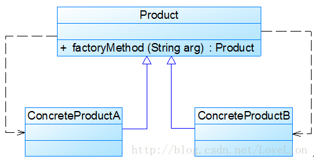

# 设计模式


[TOC]


## 概述

### 常用设计模式一览表


|             类型              |                  模式名称                  | 学习难度 | 使用频率 |
| :---------------------------: | :----------------------------------------: | :------: | :------: |
| 创建型模式 Creational Pattern |         单例模式 Singleton Pattern         |  ★☆☆☆☆   |  ★★★★☆   |
| 创建型模式 Creational Pattern |    简单工厂模式 Simple Factory Pattern     |  ★★☆☆☆   |  ★★★☆☆   |
| 创建型模式 Creational Pattern |    工厂方法模式 Factory Method Pattern     |  ★★☆☆☆   |  ★★★★★   |
| 创建型模式 Creational Pattern |   抽象工厂模式 Abstract Factory Pattern    |  ★★★★☆   |  ★★★★★   |
| 创建型模式 Creational Pattern |         原型模式 Prototype Pattern         |  ★★★☆☆   |  ★★★☆☆   |
| 创建型模式 Creational Pattern |         建造者模式 Builder Pattern         |  ★★★★☆   |  ★★☆☆☆   |
| 结构型模式 Structural Pattern |         适配器模式 Adapter Pattern         |  ★★☆☆☆   |  ★★★★☆   |
| 结构型模式 Structural Pattern |          桥接模式 Bridge Pattern           |  ★★★☆☆   |  ★★★☆☆   |
| 结构型模式 Structural Pattern |         组合模式 Composite Pattern         |  ★★★☆☆   |  ★★★★☆   |
| 结构型模式 Structural Pattern |         装饰模式 Decorator Pattern         |  ★★★☆☆   |  ★★★☆☆   |
| 结构型模式 Structural Pattern |          外观模式 Façade Pattern           |  ★☆☆☆☆   |  ★★★★★   |
| 结构型模式 Structural Pattern |         享元模式 Flyweight Pattern         |  ★★★★☆   |  ★☆☆☆☆   |
| 结构型模式 Structural Pattern |           代理模式 Proxy Pattern           |  ★★★☆☆   |  ★★★★☆   |
| 行为型模式 Behavioral Pattern | 职责链模式 Chain of Responsibility Pattern |  ★★★☆☆   |  ★★☆☆☆   |
| 行为型模式 Behavioral Pattern |          命令模式 Command Pattern          |  ★★★☆☆   |  ★★★★☆   |
| 行为型模式 Behavioral Pattern |       解释器模式 Interpreter Pattern       |  ★★★★★   |  ★☆☆☆☆   |
| 行为型模式 Behavioral Pattern |        迭代器模式 Iterator Pattern         |  ★★★☆☆   |  ★★★★★   |
| 行为型模式 Behavioral Pattern |        中介者模式 Mediator Pattern         |  ★★★☆☆   |  ★★☆☆☆   |
| 行为型模式 Behavioral Pattern |         备忘录模式 Memento Pattern         |  ★★☆☆☆   |  ★★☆☆☆   |
| 行为型模式 Behavioral Pattern |        观察者模式 Observer Pattern         |  ★★★☆☆   |  ★★★★★   |
| 行为型模式 Behavioral Pattern |           状态模式 State Pattern           |  ★★★☆☆   |  ★★★☆☆   |
| 行为型模式 Behavioral Pattern |         策略模式 Strategy Pattern          |  ★☆☆☆☆   |  ★★★★☆   |
| 行为型模式 Behavioral Pattern |    模板方法模式 Template Method Pattern    |  ★★☆☆☆   |  ★★★☆☆   |
| 行为型模式 Behavioral Pattern |         访问者模式 Visitor Pattern         |  ★★★★☆   |  ★☆☆☆☆   |

### 7种常用的面向对象设计原则

|                    设计原则名称                     |                      定 义                       | 使用频率 |
| :-------------------------------------------------: | :----------------------------------------------: | :------: |
| 单一职责原则 (Single Responsibility Principle, SRP) |       一个类只负责一个功能领域中的相应职责       |  ★★★★☆   |
|        开闭原则 (Open-Closed Principle, OCP)        |        软件实体应对扩展开放，而对修改关闭        |  ★★★★★   |
|  里氏代换原则 (Liskov Substitution Principle, LSP)  | 所有引用基类对象的地方能够透明地使用其子类的对象 |  ★★★★★   |
| 依赖倒转原则 (Dependence Inversion Principle, DIP)  |     抽象不应该依赖于细节，细节应该依赖于抽象     |  ★★★★★   |
| 接口隔离原则 (Interface Segregation Principle, ISP) |     使用多个专门的接口，而不使用单一的总接口     |  ★★☆☆☆   |
|    合成复用原则 (Composite Reuse Principle, CRP)    |   尽量使用对象组合，而不是继承来达到复用的目的   |  ★★★★☆   |
|          迪米特法则 (Law of Demeter, LoD)           | 一个软件实体应当尽可能少地与其他实体发生相互作用 |  ★★★☆☆   |

## 面向对象设计原则

### 面向对象设计原则之单一职责原则

单一职责原则是最简单的面向对象设计原则，它用于控制类的粒度大小。单一职责原则定义如下： 单一职责原则(Single Responsibility Principle, SRP)：一个类只负责一个功能领域中的相应职责，或者可以定义为：就一个类而言，应该只有一个引起它变化的原因。

单一职责原则告诉我们：一个类不能太“累”！在软件系统中，一个类（大到模块，小到方法）承担的职责越多，它被复用的可能性就越小，而且一个类承担的职责过多，就相当于将这些职责耦合在一起，当其中一个职责变化时，可能会影响其他职责的运作，因此要将这些职责进行分离，将不同的职责封装在不同的类中，即将不同的变化原因封装在不同的类中，如果多个职责总是同时发生改变则可将它们封装在同一类中。

单一职责原则是实现高内聚、低耦合的指导方针，它是最简单但又最难运用的原则，需要设计人员发现类的不同职责并将其分离，而发现类的多重职责需要设计人员具有较强的分析设计能力和相关实践经验。

下面通过一个简单实例来进一步分析单一职责原则：

Sunny软件公司开发人员针对某CRM（Customer Relationship Management，客户关系管理）系统中客户信息图形统计模块提出了如图1所示初始设计方案：


在图1中，CustomerDataChart类中的方法说明如下：getConnection()方法用于连接数据库，findCustomers()用于查询所有的客户信息，createChart()用于创建图表，displayChart()用于显示图表。

现使用单一职责原则对其进行重构。

在图1中，CustomerDataChart类承担了太多的职责，既包含与数据库相关的方法，又包含与图表生成和显示相关的方法。如果在其他类中也需要连接数据库或者使用findCustomers()方法查询客户信息，则难以实现代码的重用。无论是修改数据库连接方式还是修改图表显示方式都需要修改该类，它不止一个引起它变化的原因，违背了单一职责原则。因此需要对该类进行拆分，使其满足单一职责原则，类CustomerDataChart可拆分为如下三个类：

(1) DBUtil：负责连接数据库，包含数据库连接方法getConnection()；

(2) CustomerDAO：负责操作数据库中的Customer表，包含对Customer表的增删改查等方法，如findCustomers()；

(3) CustomerDataChart：负责图表的生成和显示，包含方法createChart()和displayChart()。

使用单一职责原则重构后的结构如图2所示：


### 面向对象设计原则之开闭原则

开闭原则是面向对象的可复用设计的第一块基石，它是最重要的面向对象设计原则。开闭原则由Bertrand Meyer于1988年提出，其定义如下：

开闭原则(Open-Closed Principle, OCP)：一个软件实体应当对扩展开放，对修改关闭。即软件实体应尽量在不修改原有代码的情况下进行扩展。

在开闭原则的定义中，软件实体可以指一个软件模块、一个由多个类组成的局部结构或一个独立的类。

任何软件都需要面临一个很重要的问题，即它们的需求会随时间的推移而发生变化。当软件系统需要面对新的需求时，我们应该尽量保证系统的设计框架是稳定的。如果一个软件设计符合开闭原则，那么可以非常方便地对系统进行扩展，而且在扩展时无须修改现有代码，使得软件系统在拥有适应性和灵活性的同时具备较好的稳定性和延续性。随着软件规模越来越大，软件寿命越来越长，软件维护成本越来越高，设计满足开闭原则的软件系统也变得越来越重要。

为了满足开闭原则，需要对系统进行抽象化设计，抽象化是开闭原则的关键。在Java、C#等编程语言中，可以为系统定义一个相对稳定的抽象层，而将不同的实现行为移至具体的实现层中完成。在很多面向对象编程语言中都提供了接口、抽象类等机制，可以通过它们定义系统的抽象层，再通过具体类来进行扩展。如果需要修改系统的行为，无须对抽象层进行任何改动，只需要增加新的具体类来实现新的业务功能即可，实现在不修改已有代码的基础上扩展系统的功能，达到开闭原则的要求。


Sunny软件公司开发的CRM系统可以显示各种类型的图表，如饼状图和柱状图等，为了支持多种图表显示方式，原始设计方案如图1所示：


图1 初始设计方案结构图

在ChartDisplay类的display()方法中存在如下代码片段：

```java
......  
if (type.equals("pie")) {
    PieChart chart = new PieChart();
    chart.display();
}  else if (type.equals("bar")) {
    BarChart chart = new BarChart();
    chart.display();  
}  
......
```

在该代码中，如果需要增加一个新的图表类，如折线图LineChart，则需要修改ChartDisplay类的display()方法的源代码，增加新的判断逻辑，违反了开闭原则。

现对该系统进行重构，使之符合开闭原则。

在本实例中，由于在ChartDisplay类的display()方法中针对每一个图表类编程，因此增加新的图表类不得不修改源代码。可以通过抽象化的方式对系统进行重构，使之增加新的图表类时无须修改源代码，满足开闭原则。

具体做法如下：

(1) 增加一个抽象图表类AbstractChart，将各种具体图表类作为其子类；

(2) ChartDisplay类针对抽象图表类进行编程，由客户端来决定使用哪种具体图表。

重构后结构如图2所示：


图2 重构后的结构图

在图2中，我们引入了抽象图表类AbstractChart，且ChartDisplay针对抽象图表类进行编程，并通过setChart()方法由客户端来设置实例化的具体图表对象，在ChartDisplay的display()方法中调用chart对象的display()方法显示图表。如果需要增加一种新的图表，如折线图LineChart，只需要将LineChart也作为AbstractChart的子类，在客户端向ChartDisplay中注入一个LineChart对象即可，无须修改现有类库的源代码。

注意：因为xml和properties等格式的配置文件是纯文本文件，可以直接通过VI编辑器或记事本进行编辑，且无须编译，因此在软件开发中，一般不把对配置文件的修改认为是对系统源代码的修改。如果一个系统在扩展时只涉及到修改配置文件，而原有的Java代码或C#代码没有做任何修改，该系统即可认为是一个符合开闭原则的系统。

### 面向对象设计原则之里氏代换原则

里氏代换原则由2008年图灵奖得主、美国第一位计算机科学女博士Barbara Liskov教授和卡内基·梅隆大学Jeannette Wing教授于1994年提出。其严格表述如下：如果对每一个类型为S的对象o1，都有类型为T的对象o2，使得以T定义的所有程序P在所有的对象o1代换o2时，程序P的行为没有变化，那么类型S是类型T的子类型。这个定义比较拗口且难以理解，因此我们一般使用它的另一个通俗版定义： 里氏代换原则(Liskov Substitution Principle, LSP)：所有引用基类（父类）的地方必须能透明地使用其子类的对象。

里氏代换原则告诉我们，在软件中将一个基类对象替换成它的子类对象，程序将不会产生任何错误和异常，反过来则不成立，如果一个软件实体使用的是一个子类对象的话，那么它不一定能够使用基类对象。例如：我喜欢动物，那我一定喜欢狗，因为狗是动物的子类；但是我喜欢狗，不能据此断定我喜欢动物，因为我并不喜欢老鼠，虽然它也是动物。

例如有两个类，一个类为BaseClass，另一个是SubClass类，并且SubClass类是BaseClass类的子类，那么一个方法如果可以接受一个BaseClass类型的基类对象base的话，如：method1(base)，那么它必然可以接受一个BaseClass类型的子类对象sub，method1(sub)能够正常运行。反过来的代换不成立，如一个方法method2接受BaseClass类型的子类对象sub为参数：method2(sub)，那么一般而言不可以有method2(base)，除非是重载方法。

里氏代换原则是实现开闭原则的重要方式之一，由于使用基类对象的地方都可以使用子类对象，因此在程序中尽量使用基类类型来对对象进行定义，而在运行时再确定其子类类型，用子类对象来替换父类对象。

在使用里氏代换原则时需要注意如下几个问题：

(1)子类的所有方法必须在父类中声明，或子类必须实现父类中声明的所有方法。根据里氏代换原则，为了保证系统的扩展性，在程序中通常使用父类来进行定义，如果一个方法只存在子类中，在父类中不提供相应的声明，则无法在以父类定义的对象中使用该方法。

(2) 我们在运用里氏代换原则时，尽量把父类设计为抽象类或者接口，让子类继承父类或实现父接口，并实现在父类中声明的方法，运行时，子类实例替换父类实例，我们可以很方便地扩展系统的功能，同时无须修改原有子类的代码，增加新的功能可以通过增加一个新的子类来实现。里氏代换原则是开闭原则的具体实现手段之一。

(3) Java语言中，在编译阶段，Java编译器会检查一个程序是否符合里氏代换原则，这是一个与实现无关的、纯语法意义上的检查，但Java编译器的检查是有局限的。

在Sunny软件公司开发的CRM系统中，客户(Customer)可以分为VIP客户(VIPCustomer)和普通客户(CommonCustomer)两类，系统需要提供一个发送Email的功能，原始设计方案如图1所示：

图1原始结构图


在对系统进行进一步分析后发现，无论是普通客户还是VIP客户，发送邮件的过程都是相同的，也就是说两个send()方法中的代码重复，而且在本系统中还将增加新类型的客户。为了让系统具有更好的扩展性，同时减少代码重复，使用里氏代换原则对其进行重构。

在本实例中，可以考虑增加一个新的抽象客户类Customer，而将CommonCustomer和VIPCustomer类作为其子类，邮件发送类EmailSender类针对抽象客户类Customer编程，根据里氏代换原则，能够接受基类对象的地方必然能够接受子类对象，因此将EmailSender中的send()方法的参数类型改为Customer，如果需要增加新类型的客户，只需将其作为Customer类的子类即可。重构后的结构如图2所示：


图2 重构后的结构图

里氏代换原则是实现开闭原则的重要方式之一。在本实例中，在传递参数时使用基类对象，除此以外，在定义成员变量、定义局部变量、确定方法返回类型时都可使用里氏代换原则。针对基类编程，在程序运行时再确定具体子类。

扩展

里氏代换原则以Barbara Liskov（芭芭拉·利斯科夫）教授的姓氏命名。芭芭拉·利斯科夫：美国计算机科学家，2008年图灵奖得主，2004年约翰·冯诺依曼奖得主，美国工程院院士，美国艺术与科学院院士，美国计算机协会会士，麻省理工学院电子电气与计算机科学系教授，美国第一位计算机科学女博士。

### 面向对象设计原则之依赖倒转原则

如果说开闭原则是面向对象设计的目标的话，那么依赖倒转原则就是面向对象设计的主要实现机制之一，它是系统抽象化的具体实现。依赖倒转原则是Robert C. Martin在1996年为“C++Reporter”所写的专栏Engineering Notebook的第三篇，后来加入到他在2002年出版的经典著作“Agile Software Development, Principles, Patterns, and Practices”一书中。依赖倒转原则定义如下： 依赖倒转原则(Dependency Inversion Principle, DIP)：抽象不应该依赖于细节，细节应当依赖于抽象。换言之，要针对接口编程，而不是针对实现编程。

依赖倒转原则要求我们**在程序代码中传递参数时或在关联关系中，尽量引用层次高的抽象层类，即使用接口和抽象类进行变量类型声明、参数类型声明、方法返回类型声明，以及数据类型的转换等，而不要用具体类来做这些事情**。为了确保该原则的应用，**一个具体类应当只实现接口或抽象类中声明过的方法，而不要给出多余的方法**，否则将无法调用到在子类中增加的新方法。

在引入抽象层后，系统将具有很好的灵活性，在程序中尽量使用抽象层进行编程，而将具体类写在配置文件中，这样一来，如果系统行为发生变化，只需要对抽象层进行扩展，并修改配置文件，而无须修改原有系统的源代码，在不修改的情况下来扩展系统的功能，满足开闭原则的要求。

在实现依赖倒转原则时，我们需要针对抽象层编程，而将具体类的对象通过依赖注入(DependencyInjection, DI)的方式注入到其他对象中，依赖注入是指当一个对象要与其他对象发生依赖关系时，通过抽象来注入所依赖的对象。常用的注入方式有三种，分别是：构造注入，设值注入（Setter注入）和接口注入。构造注入是指通过构造函数来传入具体类的对象，设值注入是指通过Setter方法来传入具体类的对象，而接口注入是指通过在接口中声明的业务方法来传入具体类的对象。这些方法在定义时使用的是抽象类型，在运行时再传入具体类型的对象，由子类对象来覆盖父类对象。

下面通过一个简单实例来加深对依赖倒转原则的理解：

Sunny软件公司开发人员在开发某CRM系统时发现：该系统经常需要将存储在TXT或Excel文件中的客户信息转存到数据库中，因此需要进行数据格式转换。在客户数据操作类中将调用数据格式转换类的方法实现格式转换和数据库插入操作，初始设计方案结构如图1所示：


图1 初始设计方案结构图

在编码实现图1所示结构时，Sunny软件公司开发人员发现该设计方案存在一个非常严重的问题，由于每次转换数据时数据来源不一定相同，因此需要更换数据转换类，如有时候需要将TXTDataConvertor改为ExcelDataConvertor，此时，需要修改CustomerDAO的源代码，而且在引入并使用新的数据转换类时也不得不修改CustomerDAO的源代码，系统扩展性较差，违反了开闭原则，现需要对该方案进行重构。

在本实例中，由于CustomerDAO针对具体数据转换类编程，因此在增加新的数据转换类或者更换数据转换类时都不得不修改CustomerDAO的源代码。我们可以通过引入抽象数据转换类解决该问题，在引入抽象数据转换类DataConvertor之后，CustomerDAO针对抽象类DataConvertor编程，而将具体数据转换类名存储在配置文件中，符合依赖倒转原则。根据里氏代换原则，程序运行时，具体数据转换类对象将替换DataConvertor类型的对象，程序不会出现任何问题。更换具体数据转换类时无须修改源代码，只需要修改配置文件；如果需要增加新的具体数据转换类，只要将新增数据转换类作为DataConvertor的子类并修改配置文件即可，原有代码无须做任何修改，满足开闭原则。重构后的结构如图2所示：


图2重构后的结构图

在上述重构过程中，我们使用了开闭原则、里氏代换原则和依赖倒转原则，在**大多数情况下，这三个设计原则会同时出现，开闭原则是目标，里氏代换原则是基础，依赖倒转原则是手段，它们相辅相成，相互补充，目标一致，只是分析问题时所站角度不同而已。**

### 面向对象设计原则之接口隔离原则

接口隔离原则定义如下：

> 接口隔离原则(Interface Segregation Principle, ISP)：使用多个专门的接口，而不使用单一的总接口，即客户端不应该依赖那些它不需要的接口。

根据接口隔离原则，当一个接口太大时，我们需要将它分割成一些更细小的接口，使用该接口的客户端仅需知道与之相关的方法即可。每一个接口应该承担一种相对独立的角色，不干不该干的事，该干的事都要干。这里的“接口”往往有两种不同的含义：一种是指一个类型所具有的方法特征的集合，仅仅是一种逻辑上的抽象；另外一种是指某种语言具体的“接口”定义，有严格的定义和结构，比如Java语言中的interface。对于这两种不同的含义，ISP的表达方式以及含义都有所不同：

(1) 当把“接口”理解成一个类型所提供的所有方法特征的集合的时候，这就是一种逻辑上的概念，接口的划分将直接带来类型的划分。可以把接口理解成角色，一个接口只能代表一个角色，每个角色都有它特定的一个接口，此时，这个原则可以叫做“角色隔离原则”。

(2) 如果把“接口”理解成狭义的特定语言的接口，那么ISP表达的意思是指接口仅仅提供客户端需要的行为，客户端不需要的行为则隐藏起来，应当为客户端提供尽可能小的单独的接口，而不要提供大的总接口。在面向对象编程语言中，实现一个接口就需要实现该接口中定义的所有方法，因此大的总接口使用起来不一定很方便，为了使接口的职责单一，需要将大接口中的方法根据其职责不同分别放在不同的小接口中，以确保每个接口使用起来都较为方便，并都承担某一单一角色。接口应该尽量细化，同时接口中的方法应该尽量少，每个接口中只包含一个客户端（如子模块或业务逻辑类）所需的方法即可，这种机制也称为“定制服务”，即为不同的客户端提供宽窄不同的接口。

下面通过一个简单实例来加深对接口隔离原则的理解：

Sunny软件公司开发人员针对某CRM系统的客户数据显示模块设计了如图1所示接口，其中方法dataRead()用于从文件中读取数据，方法transformToXML()用于将数据转换成XML格式，方法createChart()用于创建图表，方法displayChart()用于显示图表，方法createReport()用于创建文字报表，方法displayReport()用于显示文字报表。


图1 初始设计方案结构图

在实际使用过程中发现该接口很不灵活，例如如果一个具体的数据显示类无须进行数据转换（源文件本身就是XML格式），但由于实现了该接口，将不得不实现其中声明的transformToXML()方法（至少需要提供一个空实现）；如果需要创建和显示图表，除了需实现与图表相关的方法外，还需要实现创建和显示文字报表的方法，否则程序编译时将报错。

现使用接口隔离原则对其进行重构。

在图1中，由于在接口CustomerDataDisplay中定义了太多方法，即该接口承担了太多职责，一方面导致该接口的实现类很庞大，在不同的实现类中都不得不实现接口中定义的所有方法，灵活性较差，如果出现大量的空方法，将导致系统中产生大量的无用代码，影响代码质量；另一方面由于客户端针对大接口编程，将在一定程序上破坏程序的封装性，客户端看到了不应该看到的方法，没有为客户端定制接口。因此需要将该接口按照接口隔离原则和单一职责原则进行重构，将其中的一些方法封装在不同的小接口中，确保每一个接口使用起来都较为方便，并都承担某一单一角色，每个接口中只包含一个客户端（如模块或类）所需的方法即可。

通过使用接口隔离原则，本实例重构后的结构如图2所示：


图2 重构后的结构图

在使用接口隔离原则时，我们需要注意控制接口的粒度，接口不能太小，如果太小会导致系统中接口泛滥，不利于维护；接口也不能太大，太大的接口将违背接口隔离原则，灵活性较差，使用起来很不方便。一般而言，接口中仅包含为某一类用户定制的方法即可，不应该强迫客户依赖于那些它们不用的方法。

### 面向对象设计原则之合成复用原则

合成复用原则又称为组合/聚合复用原则(Composition/Aggregate Reuse Principle, CARP)，其定义如下：

> 合成复用原则(Composite Reuse Principle, CRP)：尽量使用对象组合，而不是继承来达到复用的目的。

合成复用原则就是在一个新的对象里通过关联关系（包括组合关系和聚合关系）来使用一些已有的对象，使之成为新对象的一部分；新对象通过委派调用已有对象的方法达到复用功能的目的。简言之：复用时要尽量使用组合/聚合关系（关联关系），少用继承。

在面向对象设计中，可以通过两种方法在不同的环境中复用已有的设计和实现，即通过组合/聚合关系或通过继承，但首先应该考虑使用组合/聚合，组合/聚合可以使系统更加灵活，降低类与类之间的耦合度，一个类的变化对其他类造成的影响相对较少；其次才考虑继承，在使用继承时，需要严格遵循里氏代换原则，有效使用继承会有助于对问题的理解，降低复杂度，而滥用继承反而会增加系统构建和维护的难度以及系统的复杂度，因此需要慎重使用继承复用。

通过继承来进行复用的主要问题在于继承复用会破坏系统的封装性，因为继承会将基类的实现细节暴露给子类，由于基类的内部细节通常对子类来说是可见的，所以这种复用又称“白箱”复用，如果基类发生改变，那么子类的实现也不得不发生改变；从基类继承而来的实现是静态的，不可能在运行时发生改变，没有足够的灵活性；而且继承只能在有限的环境中使用（如类没有声明为不能被继承）。

扩展

对于继承的深入理解，大家可以参考《软件架构设计》一书作者温昱先生的文章——《见山只是山见水只是水——提升对继承的认识》。

由于组合或聚合关系可以将已有的对象（也可称为成员对象）纳入到新对象中，使之成为新对象的一部分，因此新对象可以调用已有对象的功能，这样做可以使得成员对象的内部实现细节对于新对象不可见，所以这种复用又称为“黑箱”复用，相对继承关系而言，其耦合度相对较低，成员对象的变化对新对象的影响不大，可以在新对象中根据实际需要有选择性地调用成员对象的操作；合成复用可以在运行时动态进行，新对象可以动态地引用与成员对象类型相同的其他对象。

一般而言，如果两个类之间是“Has-A”的关系应使用组合或聚合，如果是“Is-A”关系可使用继承。”Is-A”是严格的分类学意义上的定义，意思是一个类是另一个类的”一种”；而”Has-A”则不同，它表示某一个角色具有某一项责任。

下面通过一个简单实例来加深对合成复用原则的理解：

Sunny软件公司开发人员在初期的CRM系统设计中，考虑到客户数量不多，系统采用MySQL作为数据库，与数据库操作有关的类如CustomerDAO类等都需要连接数据库，连接数据库的方法getConnection()封装在DBUtil类中，由于需要重用DBUtil类的getConnection()方法，设计人员将CustomerDAO作为DBUtil类的子类，初始设计方案结构如图1所示：


图1 初始设计方案结构图

随着客户数量的增加，系统决定升级为Oracle数据库，因此需要增加一个新的OracleDBUtil类来连接Oracle数据库，由于在初始设计方案中CustomerDAO和DBUtil之间是继承关系，因此在更换数据库连接方式时需要修改CustomerDAO类的源代码，将CustomerDAO作为OracleDBUtil的子类，这将违反开闭原则。【当然也可以修改DBUtil类的源代码，同样会违反开闭原则。】

现使用合成复用原则对其进行重构。

根据合成复用原则，我们在实现复用时应该多用关联，少用继承。因此在本实例中我们可以使用关联复用来取代继承复用，重构后的结构如图2所示：


图2 重构后的结构图

在图2中，CustomerDAO和DBUtil之间的关系由继承关系变为关联关系，采用依赖注入的方式将DBUtil对象注入到CustomerDAO中，可以使用构造注入，也可以使用Setter注入。如果需要对DBUtil的功能进行扩展，可以通过其子类来实现，如通过子类OracleDBUtil来连接Oracle数据库。由于CustomerDAO针对DBUtil编程，根据里氏代换原则，DBUtil子类的对象可以覆盖DBUtil对象，只需在CustomerDAO中注入子类对象即可使用子类所扩展的方法。例如在CustomerDAO中注入OracleDBUtil对象，即可实现Oracle数据库连接，原有代码无须进行修改，而且还可以很灵活地增加新的数据库连接方式。

### 面向对象设计原则之迪米特法则

迪米特法则来自于1987年美国东北大学(Northeastern University)一个名为“Demeter”的研究项目。迪米特法则又称为最少知识原则(LeastKnowledge Principle, LKP)，其定义如下：

> 迪米特法则(Law of Demeter, LoD)：一个软件实体应当尽可能少地与其他实体发生相互作用。

如果一个系统符合迪米特法则，那么当其中某一个模块发生修改时，就会尽量少地影响其他模块，扩展会相对容易，这是对软件实体之间通信的限制，迪米特法则要求限制软件实体之间通信的宽度和深度。迪米特法则可降低系统的耦合度，使类与类之间保持松散的耦合关系。

迪米特法则还有几种定义形式，包括：不要和“陌生人”说话、只与你的直接朋友通信等，在迪米特法则中，对于一个对象，其朋友包括以下几类：

(1) 当前对象本身(this)；

(2) 以参数形式传入到当前对象方法中的对象；

(3) 当前对象的成员对象；

(4) 如果当前对象的成员对象是一个集合，那么集合中的元素也都是朋友；

(5) 当前对象所创建的对象。

任何一个对象，如果满足上面的条件之一，就是当前对象的“朋友”，否则就是“陌生人”。在应用迪米特法则时，一个对象只能与直接朋友发生交互，不要与“陌生人”发生直接交互，这样做可以降低系统的耦合度，一个对象的改变不会给太多其他对象带来影响。

迪米特法则要求我们在设计系统时，应该尽量减少对象之间的交互，如果两个对象之间不必彼此直接通信，那么这两个对象就不应当发生任何直接的相互作用，如果其中的一个对象需要调用另一个对象的某一个方法的话，可以通过第三者转发这个调用。简言之，就是通过引入一个合理的第三者来降低现有对象之间的耦合度。

在将迪米特法则运用到系统设计中时，要注意下面的几点：在类的划分上，应当尽量创建松耦合的类，类之间的耦合度越低，就越有利于复用，一个处在松耦合中的类一旦被修改，不会对关联的类造成太大波及；在类的结构设计上，每一个类都应当尽量降低其成员变量和成员函数的访问权限；在类的设计上，只要有可能，一个类型应当设计成不变类；在对其他类的引用上，一个对象对其他对象的引用应当降到最低。

下面通过一个简单实例来加深对迪米特法则的理解：

Sunny软件公司所开发CRM系统包含很多业务操作窗口，在这些窗口中，某些界面控件之间存在复杂的交互关系，一个控件事件的触发将导致多个其他界面控件产生响应，例如，当一个按钮(Button)被单击时，对应的列表框(List)、组合框(ComboBox)、文本框(TextBox)、文本标签(Label)等都将发生改变，在初始设计方案中，界面控件之间的交互关系可简化为如图1所示结构：


图1 初始设计方案结构图

在图1中，由于界面控件之间的交互关系复杂，导致在该窗口中增加新的界面控件时需要修改与之交互的其他控件的源代码，系统扩展性较差，也不便于增加和删除新控件。

现使用迪米特对其进行重构。

在本实例中，可以通过引入一个专门用于控制界面控件交互的中间类(Mediator)来降低界面控件之间的耦合度。引入中间类之后，界面控件之间不再发生直接引用，而是将请求先转发给中间类，再由中间类来完成对其他控件的调用。当需要增加或删除新的控件时，只需修改中间类即可，无须修改新增控件或已有控件的源代码，重构后结构如图2所示：


## 六个创建型模式

### 简单工厂模式-Simple Factory Pattern

#### 工厂三兄弟之简单工厂模式（一）

工厂模式是最常用的一类创建型设计模式，通常我们所说的工厂模式是指工厂方法模式，它也是使用频率最高的工厂模式。本章将要学习的简单工厂模式是工厂方法模式的“小弟”，它不属于GoF 23种设计模式，但在软件开发中应用也较为频繁，通常将它作为学习其他工厂模式的入门。此外，工厂方法模式还有一位“大哥”——抽象工厂模式。这三种工厂模式各具特色，难度也逐个加大，在软件开发中它们都得到了广泛的应用，成为面向对象软件中常用的创建对象的工具。

1 图表库的设计

Sunny软件公司欲基于Java语言开发一套图表库，该图表库可以为应用系统提供各种不同外观的图表，例如柱状图、饼状图、折线图等。Sunny软件公司图表库设计人员希望为应用系统开发人员提供一套灵活易用的图表库，而且可以较为方便地对图表库进行扩展，以便能够在将来增加一些新类型的图表。

Sunny软件公司图表库设计人员提出了一个初始设计方案，将所有图表的实现代码封装在一个Chart类中，其框架代码如下所示：

```java
class Chart {  
    private String type; //图表类型  
    public Chart(Object[][] data, String type) {  
        this.type = type;  
        if (type.equalsIgnoreCase("histogram")) {  
            //初始化柱状图  
        }  
        else if (type.equalsIgnoreCase("pie")) {  
            //初始化饼状图  
        }  
        else if (type.equalsIgnoreCase("line")) {  
            //初始化折线图  
        }  
    }  
    public void display() {  
        if (this.type.equalsIgnoreCase("histogram")) {  
            //显示柱状图  
        }  
        else if (this.type.equalsIgnoreCase("pie")) {  
            //显示饼状图  
        }  
        else if (this.type.equalsIgnoreCase("line")) {  
            //显示折线图  
        }     
    }  
}
```

客户端代码通过调用Chart类的构造函数来创建图表对象，根据参数type的不同可以得到不同类型的图表，然后再调用display()方法来显示相应的图表。

不难看出，Chart类是一个“巨大的”类，在该类的设计中存在如下几个问题：

(1) 在Chart类中包含很多“if…else…”代码块，整个类的代码相当冗长，代码越长，阅读难度、维护难度和测试难度也越大；而且大量条件语句的存在还将影响系统的性能，程序在执行过程中需要做大量的条件判断。

(2) Chart类的职责过重，它负责初始化和显示所有的图表对象，将各种图表对象的初始化代码和显示代码集中在一个类中实现，违反了“单一职责原则”，不利于类的重用和维护；而且将大量的对象初始化代码都写在构造函数中将导致构造函数非常庞大，对象在创建时需要进行条件判断，降低了对象创建的效率。

(3) 当需要增加新类型的图表时，必须修改Chart类的源代码，违反了“开闭原则”。

(4) 客户端只能通过new关键字来直接创建Chart对象，Chart类与客户端类耦合度较高，对象的创建和使用无法分离。

(5) 客户端在创建Chart对象之前可能还需要进行大量初始化设置，例如设置柱状图的颜色、高度等，如果在Chart类的构造函数中没有提供一个默认设置，那就只能由客户端来完成初始设置，这些代码在每次创建Chart对象时都会出现，导致代码的重复。

面对一个如此巨大、职责如此重，且与客户端代码耦合度非常高的类，我们应该怎么办？本章将要介绍的简单工厂模式将在一定程度上解决上述问题。

为什么要引入工厂类，大家可参见：[创建对象与使用对象——谈谈工厂的作用](http://blog.csdn.net/lovelion/article/details/7523392)。

#### 工厂三兄弟之简单工厂模式（二）

2 简单工厂模式概述

简单工厂模式并不属于GoF 23个经典设计模式，但通常将它作为学习其他工厂模式的基础，它的设计思想很简单，其基本流程如下：

首先将需要创建的各种不同对象（例如各种不同的Chart对象）的相关代码封装到不同的类中，这些类称为具体产品类，而将它们公共的代码进行抽象和提取后封装在一个抽象产品类中，每一个具体产品类都是抽象产品类的子类；然后提供一个工厂类用于创建各种产品，在工厂类中提供一个创建产品的工厂方法，该方法可以根据所传入的参数不同创建不同的具体产品对象；客户端只需调用工厂类的工厂方法并传入相应的参数即可得到一个产品对象。

简单工厂模式定义如下：

**简单工厂模式(Simple Factory Pattern)：定义一个工厂类，它可以根据参数的不同返回不同类的实例，被创建的实例通常都具有共同的父类。因为在简单工厂模式中用于创建实例的方法是静态(static)方法，因此简单工厂模式又被称为静态工厂方法(Static Factory Method)模式，它属于类创建型模式。**

简单工厂模式的要点在于：当你需要什么，只需要传入一个正确的参数，就可以获取你所需要的对象，而无须知道其创建细节。简单工厂模式结构比较简单，其核心是工厂类的设计，其结构如图1所示：


图1 简单工厂模式结构图

在简单工厂模式结构图中包含如下几个角色：

● Factory（工厂角色）：工厂角色即工厂类，它是简单工厂模式的核心，负责实现创建所有产品实例的内部逻辑；工厂类可以被外界直接调用，创建所需的产品对象；在工厂类中提供了静态的工厂方法factoryMethod()，它的返回类型为抽象产品类型Product。

● Product（抽象产品角色）：它是工厂类所创建的所有对象的父类，封装了各种产品对象的公有方法，它的引入将提高系统的灵活性，使得在工厂类中只需定义一个通用的工厂方法，因为所有创建的具体产品对象都是其子类对象。

● ConcreteProduct（具体产品角色）：它是简单工厂模式的创建目标，所有被创建的对象都充当这个角色的某个具体类的实例。每一个具体产品角色都继承了抽象产品角色，需要实现在抽象产品中声明的抽象方法。

在简单工厂模式中，**客户端通过工厂类来创建一个产品类的实例，而无须直接使用new关键字来创建对象，它是工厂模式家族中最简单的一员**。

在使用简单工厂模式时，首先需要对产品类进行重构，不能设计一个包罗万象的产品类，而需根据实际情况设计一个产品层次结构，将所有产品类公共的代码移至抽象产品类，并在抽象产品类中声明一些抽象方法，以供不同的具体产品类来实现，典型的抽象产品类代码如下所示：

```java
abstract class Product {  
    //所有产品类的公共业务方法  
    public void methodSame() {  
        //公共方法的实现  
    }  
    //声明抽象业务方法  
    public abstract void methodDiff();  
}

class ConcreteProduct extends Product {  
    //实现业务方法  
    public void methodDiff() {  
        //业务方法的实现  
    }  
}
class Factory {  
    //静态工厂方法  
    public static Product getProduct(String arg) {  
        Product product = null;  
        if (arg.equalsIgnoreCase("A")) {  
            product = new ConcreteProductA();  
            //初始化设置product  
        }  
        else if (arg.equalsIgnoreCase("B")) {  
            product = new ConcreteProductB();  
            //初始化设置product  
        }  
        return product;  
    }  
}
class Client {  
    public static void main(String args[]) {  
        Product product;   
        product = Factory.getProduct("A"); //通过工厂类创建产品对象  
        product.methodSame();  
        product.methodDiff();  
    }  
}
```


#### 工厂三兄弟之简单工厂模式（三）

3 完整解决方案

为了将Chart类的职责分离，同时将Chart对象的创建和使用分离，Sunny软件公司开发人员决定使用简单工厂模式对图表库进行重构，重构后的结构如图2所示：


图2 图表库结构图

在图2中，Chart接口充当抽象产品类，其子类HistogramChart、PieChart和LineChart充当具体产品类，ChartFactory充当工厂类。完整代码如下所示：

```java
//抽象图表接口：抽象产品类  
interface Chart {  
    public void display();  
}  
//柱状图类：具体产品类  
class HistogramChart implements Chart {  
    public HistogramChart() {  
        System.out.println("创建柱状图！");  
    }  
    public void display() {  
        System.out.println("显示柱状图！");  
    }  
}  
//饼状图类：具体产品类  
class PieChart implements Chart {  
    public PieChart() {  
        System.out.println("创建饼状图！");  
    }  
    public void display() {  
        System.out.println("显示饼状图！");  
    }  
}  
//折线图类：具体产品类  
class LineChart implements Chart {  
    public LineChart() {  
        System.out.println("创建折线图！");  
    }  
    public void display() {  
        System.out.println("显示折线图！");  
    }  
}  
//图表工厂类：工厂类  
class ChartFactory {  
    //静态工厂方法  
    public static Chart getChart(String type) {  
        Chart chart = null;  
        if (type.equalsIgnoreCase("histogram")) {  
            chart = new HistogramChart();  
            System.out.println("初始化设置柱状图！");  
        }  
        else if (type.equalsIgnoreCase("pie")) {  
            chart = new PieChart();  
            System.out.println("初始化设置饼状图！");  
        }  
        else if (type.equalsIgnoreCase("line")) {  
            chart = new LineChart();  
            System.out.println("初始化设置折线图！");              
        }  
        return chart;  
    }  
}
```

编写如下客户端测试代码：

```java
class Client {  
    public static void main(String args[]) {  
        Chart chart;  
        chart = ChartFactory.getChart("histogram"); //通过静态工厂方法创建产品  
        chart.display();  
    }  
}
```

编译并运行程序，输出结果如下：

```
创建柱状图！初始化设置柱状图！显示柱状图！
```

在客户端测试类中，我们使用工厂类的静态工厂方法创建产品对象，如果需要更换产品，只需修改静态工厂方法中的参数即可，例如将柱状图改为饼状图，只需将代码：

```
chart = ChartFactory.getChart("histogram");
```

改为：

```
chart = ChartFactory.getChart("pie");
```

编译并运行程序，输出结果如下：

```
创建饼状图！
初始化设置饼状图！
显示饼状图！
```

#### 工厂三兄弟之简单工厂模式（四）

4 方案的改进

Sunny软件公司开发人员发现在创建具体Chart对象时，每更换一个Chart对象都需要修改客户端代码中静态工厂方法的参数，客户端代码将要重新编译，这对于客户端而言，违反了“开闭原则”，有没有一种方法能够在不修改客户端代码的前提下更换具体产品对象呢？答案是肯定的，下面将介绍一种常用的实现方式。

我们可以将静态工厂方法的参数存储在XML或properties格式的配置文件中，如下*config.xml*所示：

```xml
<?xml version="1.0"?>  
<config>  
    <chartType>histogram</chartType>  
</config>
```

再通过一个工具类XMLUtil来读取配置文件中的字符串参数，XMLUtil类的代码如下所示：

```java
import javax.xml.parsers.*;  
import org.w3c.dom.*;  
import org.xml.sax.SAXException;  
import java.io.*;  
public class XMLUtil {  
    //该方法用于从XML配置文件中提取图表类型，并返回类型名  
    public static String getChartType() {  
        try {  
            //创建文档对象  
            DocumentBuilderFactory dFactory = DocumentBuilderFactory.newInstance();  
            DocumentBuilder builder = dFactory.newDocumentBuilder();  
            Document doc;                             
            doc = builder.parse(new File("config.xml"));   
            //获取包含图表类型的文本节点  
            NodeList nl = doc.getElementsByTagName("chartType");  
            Node classNode = nl.item(0).getFirstChild();  
            String chartType = classNode.getNodeValue().trim();  
            return chartType;  
        }     
        catch(Exception e) {  
            e.printStackTrace();  
            return null;  
        }  
    }  
}
```

在引入了配置文件和工具类XMLUtil之后，客户端代码修改如下：

```java
class Client {  
    public static void main(String args[]) {  
        Chart chart;  
        String type = XMLUtil.getChartType(); //读取配置文件中的参数  
        chart = ChartFactory.getChart(type); //创建产品对象  
        chart.display();  
    }  
}
```

不难发现，在上述客户端代码中不包含任何与具体图表对象相关的信息，如果需要更换具体图表对象，只需修改配置文件config.xml，无须修改任何源代码，符合“开闭原则”。

思考

> 在简单工厂模式中增加新的具体产品时是否符合“开闭原则”？如果不符合，原有系统需作出哪些修改？

5 简单工厂模式的简化

有时候，为了简化简单工厂模式，我们可以将抽象产品类和工厂类合并，将静态工厂方法移至抽象产品类中，如图3所示：



图3 简化的简单工厂模式

在图3中，客户端可以通过产品父类的静态工厂方法，根据参数的不同创建不同类型的产品子类对象，这种做法在JDK等类库和框架中也广泛存在。

6 简单工厂模式总结

简单工厂模式提供了专门的工厂类用于创建对象，将对象的创建和对象的使用分离开，它作为一种最简单的工厂模式在软件开发中得到了较为广泛的应用。

1. 主要优点

简单工厂模式的主要优点如下：

(1) 工厂类包含必要的判断逻辑，可以决定在什么时候创建哪一个产品类的实例，客户端可以免除直接创建产品对象的职责，而仅仅“消费”产品，简单工厂模式实现了对象创建和使用的分离。

(2) 客户端无须知道所创建的具体产品类的类名，只需要知道具体产品类所对应的参数即可，对于一些复杂的类名，通过简单工厂模式可以在一定程度减少使用者的记忆量。

(3) 通过引入配置文件，可以在不修改任何客户端代码的情况下更换和增加新的具体产品类，在一定程度上提高了系统的灵活性。

1. 主要缺点

简单工厂模式的主要缺点如下：

(1) 由于工厂类集中了所有产品的创建逻辑，职责过重，一旦不能正常工作，整个系统都要受到影响。

(2) 使用简单工厂模式势必会增加系统中类的个数（引入了新的工厂类），增加了系统的复杂度和理解难度。

(3) 系统扩展困难，一旦添加新产品就不得不修改工厂逻辑，在产品类型较多时，有可能造成工厂逻辑过于复杂，不利于系统的扩展和维护。

(4) 简单工厂模式由于使用了静态工厂方法，造成工厂角色无法形成基于继承的等级结构。

1. 适用场景

在以下情况下可以考虑使用简单工厂模式：

(1) 工厂类负责创建的对象比较少，由于创建的对象较少，不会造成工厂方法中的业务逻辑太过复杂。

(2) 客户端只知道传入工厂类的参数，对于如何创建对象并不关心。

### 工厂方法模式-Factory Method Pattern

#### 工厂三兄弟之工厂方法模式（一）

简单工厂模式虽然简单，但存在一个很严重的问题。当系统中需要引入新产品时，由于静态工厂方法通过所传入参数的不同来创建不同的产品，这必定要修改工厂类的源代码，将违背“开闭原则”，如何实现增加新产品而不影响已有代码？工厂方法模式应运而生，本文将介绍第二种工厂模式——工厂方法模式。

1 日志记录器的设计

Sunny软件公司欲开发一个系统运行日志记录器(Logger)，该记录器可以通过多种途径保存系统的运行日志，如通过文件记录或数据库记录，用户可以通过修改配置文件灵活地更换日志记录方式。在设计各类日志记录器时，Sunny公司的开发人员发现需要对日志记录器进行一些初始化工作，初始化参数的设置过程较为复杂，而且某些参数的设置有严格的先后次序，否则可能会发生记录失败。如何封装记录器的初始化过程并保证多种记录器切换的灵活性是Sunny公司开发人员面临的一个难题。

Sunny公司的开发人员通过对该需求进行分析，发现该日志记录器有两个设计要点：

(1) 需要封装日志记录器的初始化过程，这些初始化工作较为复杂，例如需要初始化其他相关的类，还有可能需要读取配置文件（例如连接数据库或创建文件），导致代码较长，如果将它们都写在构造函数中，会导致构造函数庞大，不利于代码的修改和维护；

(2) 用户可能需要更换日志记录方式，在客户端代码中需要提供一种灵活的方式来选择日志记录器，尽量在不修改源代码的基础上更换或者增加日志记录方式。

Sunny公司开发人员最初使用简单工厂模式对日志记录器进行了设计，初始结构如图1所示：


图1 基于简单工厂模式设计的日志记录器结构图

在图1中，LoggerFactory充当创建日志记录器的工厂，提供了工厂方法createLogger()用于创建日志记录器，Logger是抽象日志记录器接口，其子类为具体日志记录器。其中，工厂类LoggerFactory代码片段如下所示：

```java
//日志记录器工厂  
class LoggerFactory {  
    //静态工厂方法  
    public static Logger createLogger(String args) {  
        if(args.equalsIgnoreCase("db")) {  
            //连接数据库，代码省略  
            //创建数据库日志记录器对象  
            Logger logger = new DatabaseLogger();   
            //初始化数据库日志记录器，代码省略  
            return logger;  
        }  
        else if(args.equalsIgnoreCase("file")) {  
            //创建日志文件  
            //创建文件日志记录器对象  
            Logger logger = new FileLogger();   
            //初始化文件日志记录器，代码省略  
            return logger;            
        }  
        else {  
            return null;  
        }  
    }  
}
```

为了突出设计重点，我们对上述代码进行了简化，省略了具体日志记录器类的初始化代码。在LoggerFactory类中提供了静态工厂方法createLogger()，用于根据所传入的参数创建各种不同类型的日志记录器。通过使用简单工厂模式，我们将日志记录器对象的创建和使用分离，客户端只需使用由工厂类创建的日志记录器对象即可，无须关心对象的创建过程，但是我们发现，虽然简单工厂模式实现了对象的创建和使用分离，但是仍然存在如下两个问题：

(1) 工厂类过于庞大，包含了大量的if…else…代码，导致维护和测试难度增大；

(2) 系统扩展不灵活，如果增加新类型的日志记录器，必须修改静态工厂方法的业务逻辑，违反了“开闭原则”。

如何解决这两个问题，提供一种简单工厂模式的改进方案？这就是本文所介绍的工厂方法模式的动机之一。

#### 工厂三兄弟之工厂方法模式（二）

2 工厂方法模式概述

在简单工厂模式中只提供一个工厂类，该工厂类处于对产品类进行实例化的中心位置，它需要知道每一个产品对象的创建细节，并决定何时实例化哪一个产品类。简单工厂模式最大的缺点是当有新产品要加入到系统中时，必须修改工厂类，需要在其中加入必要的业务逻辑，这违背了“开闭原则”。此外，在简单工厂模式中，所有的产品都由同一个工厂创建，工厂类职责较重，业务逻辑较为复杂，具体产品与工厂类之间的耦合度高，严重影响了系统的灵活性和扩展性，而工厂方法模式则可以很好地解决这一问题。

在工厂方法模式中，我们不再提供一个统一的工厂类来创建所有的产品对象，而是针对不同的产品提供不同的工厂，系统提供一个与产品等级结构对应的工厂等级结构。工厂方法模式定义如下：

工厂方法模式(Factory Method Pattern)：定义一个用于创建对象的接口，让子类决定将哪一个类实例化。工厂方法模式让一个类的实例化延迟到其子类。工厂方法模式又简称为工厂模式(Factory Pattern)，又可称作虚拟构造器模式(Virtual Constructor Pattern)或多态工厂模式(Polymorphic Factory Pattern)。工厂方法模式是一种类创建型模式。

工厂方法模式提供一个抽象工厂接口来声明抽象工厂方法，而由其子类来具体实现工厂方法，创建具体的产品对象。工厂方法模式结构如图2所示：


